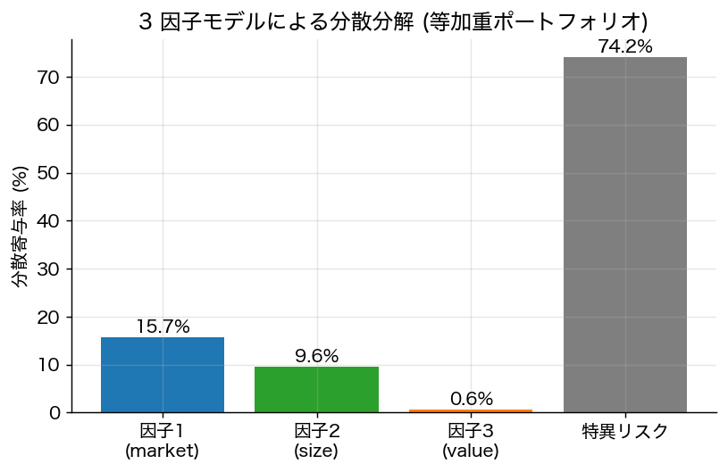

# 第5章 裁定価格理論（APT）とファクターモデル

CAPM が「市場全体の効率性」という強い均衡条件を要求するのに対して、APT (Ross 1976) は **「裁定機会の不在」** という極めて弱い条件のみから多因子資産価格モデルを導出する。

## 5.1 線形 K ファクターモデル

各資産のリターンが
$$
R_i = \mu_i + \sum_{k=1}^K b_{ik} f_k + \varepsilon_i, \qquad \mathbb{E}[f_k] = 0,\ \mathbb{E}[\varepsilon_i] = 0,\ \mathrm{Cov}(f_k, \varepsilon_i) = 0
$$
で表されると仮定する。$f = (f_1, \dots, f_K)^\top$ を **共通因子（systematic factors）**、$b_i = (b_{i1}, \dots, b_{iK})^\top$ を **因子負荷量（factor loadings）**、$\varepsilon_i$ を **固有リスク（idiosyncratic risk）** という。さらに固有リスクは **資産間で無相関** とする：$\mathrm{Cov}(\varepsilon_i, \varepsilon_j) = 0\ (i \neq j)$。

行列形式：$R = \mu + B f + \varepsilon$。

## 5.2 APT の主張と証明方針

**定理 5.1**（APT、Ross 1976）
資産数 $n$ が十分大きく上記モデルが成立するとき、無裁定の必要条件として
$$
\boxed{\;
\mu_i \approx \lambda_0 + \sum_{k=1}^K b_{ik} \lambda_k\ \text{（全 } i \text{ に対して）}
\;}
$$
が成立する。すなわち期待リターンは因子負荷量の **線形関数** で表される。$\lambda_0$ はリスクフリーレート（あるいはゼロ β 期待リターン）、$\lambda_k$ は **因子 $k$ のリスクプレミアム**。

**証明スケッチ**（裁定論証による）：

1. **裁定ポートフォリオの構築**：投資ゼロ（$\mathbf{1}^\top w = 0$）、因子曝露ゼロ（$B^\top w = 0$）の重み $w$ を選ぶ。
2. このポートフォリオのリターンは $w^\top R = w^\top \mu + w^\top \varepsilon$、平均は $w^\top \mu$、分散は $w^\top D w$（$D = \mathrm{diag}(\sigma_{\varepsilon_i}^2)$）。
3. $n \to \infty$ で **十分に分散** された $w$ を取れる場合、$w^\top D w \to 0$（大数の法則）。すると裁定ポートフォリオは **ほぼ確実な定数リターン** $w^\top \mu$ を持つ。
4. 無裁定条件はこれが $0$ であることを要求：$\mathbf{1}^\top w = 0$, $B^\top w = 0 \Rightarrow w^\top \mu = 0$。
5. すなわち $\mu$ は $\mathbf{1}$ と $B$ の列空間に属する：$\mu = \lambda_0 \mathbf{1} + B \lambda$。$\square$

厳密には $n \to \infty$ の漸近的議論、誤差項 $\|\mu - \lambda_0\mathbf{1} - B\lambda\|^2$ が有界という形での主張になる。完全に厳密な定式化は Huberman (1982), Ingersoll (1984) を参照。

## 5.3 CAPM との関係

CAPM は **1 ファクター APT** の特別形：$K = 1$, $f_1 = R_M - \mathbb{E}[R_M]$, $b_{i1} = \beta_i$, $\lambda_0 = r_f$, $\lambda_1 = \mathbb{E}[R_M] - r_f$。

しかし APT は

- **市場ポートフォリオ** を明示的に必要としない（Roll 批判を回避）。
- **均衡論** を仮定せず、無裁定のみを使う。
- 多因子（複数の系統的リスク源）を許容する。

代償として **どの因子か** は理論的には決まらず、**経験的に選定** する必要がある。

## 5.4 実証的ファクターモデル

### 5.4.1 Fama–French 3 ファクターモデル

$$
R_i - r_f = \alpha_i + b_i (R_M - r_f) + s_i \cdot \mathrm{SMB} + h_i \cdot \mathrm{HML} + \varepsilon_i
$$
- **SMB**（Small Minus Big）：小型株−大型株の超過リターン
- **HML**（High Minus Low）：高 B/M 株−低 B/M 株（バリュー）の超過リターン

3 ファクターで CAPM の主要なアノマリ（サイズ効果、バリュー効果）を吸収。

### 5.4.2 Carhart 4 ファクター

3 ファクター + **MOM**（モメンタム：過去 12 ヶ月のリターン上位−下位）。

### 5.4.3 Fama–French 5 ファクター

3 ファクター + **RMW**（収益性）+ **CMA**（投資保守度）。

### 5.4.4 Q ファクター・行動ファクター

Hou–Xue–Zhang (2015) の Q ファクター、その他多数の「動物園（factor zoo）」。Cochrane (2011) の有名な指摘：**「ファクターの動物園」問題**。

## 5.5 推定とリスク予算

ファクターモデルの大きな実用利点：

- **共分散行列の縮約**：$\Sigma = B \Omega B^\top + D$（$\Omega$ は因子共分散、$D$ は対角の特異分散）。$n$ 資産で $n(n+1)/2$ パラメタが $nK + K(K+1)/2 + n$ に減る。**ノイズが減り、最適化が安定** する。
- **リスク要因分解（risk attribution）**：ポートフォリオの分散を「市場リスク・スタイルリスク・銘柄選択リスク」に分解。
- **リスク予算（risk budgeting）**：各要因への曝露量を制約として加えた最適化。

## 5.6 主成分分析（PCA）的因子

「観察可能なファクター」ではなく、共分散行列の **主成分** を用いる手法（**統計的因子モデル**）。Chamberlain–Rothschild (1983) の **近似因子モデル** はその理論的基礎を与え、$\Sigma$ の固有値の発散順序によって「強い因子」と「弱い因子」を区別する。

## 5.7 まとめ

- APT は **無裁定 + 大数の法則** から多因子線形価格モデルを導く。
- CAPM の 1 因子化は厳しい仮定。実証的には 3–5 因子が支持される。
- 因子モデルは共分散行列推定・リスク管理・パフォーマンス分析の中核技術。

---
[← 第4章](04_capm.md) ｜ [次章 → 第6章 効用理論](06_utility_theory.md)
