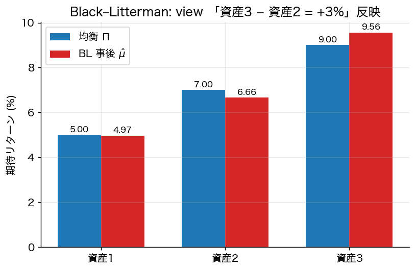

# 第9章 Black–Litterman モデル

Markowitz 最適化は推定誤差を増幅する（**極端なロングショート**、**入力に対する高感度**）。Black & Litterman (1992) は **均衡を事前情報、投資家の主観的見方を観測情報** とするベイズ枠組みで、この問題を本質的に解決した。

## 9.1 出発点：暗黙の均衡リターン

平均分散最適化を逆向きに使う：**現実の市場ポートフォリオ $w^M$**（時価総額比例）を「均衡における最適解」と見なし、それを生成する **暗黙の期待リターン** $\Pi$ を逆算する。

平均分散効用 $U(w) = w^\top\mu - \tfrac{\gamma}{2} w^\top \Sigma w$ の最適性条件 $w^\star = \gamma^{-1} \Sigma^{-1} (\mu - r_f\mathbf{1})$ より
$$
\boxed{\;
\Pi = \gamma\, \Sigma\, w^M + r_f \mathbf{1}
\;}
$$
（**Sharpe’s implied returns** とも呼ぶ）。$\gamma$ は市場全体のリスク回避度。

## 9.2 ベイズ的見方の取り込み

投資家は **$K$ 本の主観的な見方（views）** を持つとする。これを線形等式
$$
P \mu = Q + \eta, \qquad \eta \sim \mathcal{N}(0, \Omega)
$$
で表現する。
- $P \in \mathbb{R}^{K\times n}$：各見方が「どの資産の組合せ」に関わるか。
- $Q \in \mathbb{R}^K$：見方の **期待値**。
- $\Omega \in \mathbb{R}^{K\times K}$：見方の **不確実性**（対角成分が大きいほど自信が薄い）。

**例**：
- 「資産 A は資産 B より 3% 高い」→ $P$ の行は $(0, \dots, 1, \dots, -1, \dots, 0)$、$Q = 0.03$。
- 「資産 C は絶対的に 8% のリターンを上げる」→ $P$ の行は単位ベクトル、$Q = 0.08$。

## 9.3 事前分布と事後分布

**事前**：$\mu \sim \mathcal{N}(\Pi, \tau \Sigma)$。スケール $\tau$ は均衡への自信度を制御（典型的に $\tau \in [0.025, 0.05]$）。

**観測**：$P \mu \sim \mathcal{N}(Q, \Omega)$。

これらをベイズ更新する。

**定理 9.1**（Black–Litterman の事後分布）
事後分布 $\mu | \text{views}$ は正規分布で、
$$
\boxed{\;
\hat\mu_{\rm BL} = \bigl[(\tau\Sigma)^{-1} + P^\top \Omega^{-1} P \bigr]^{-1}\bigl[(\tau\Sigma)^{-1} \Pi + P^\top \Omega^{-1} Q\bigr]
\;}
$$
$$
\hat\Sigma_{\rm BL,\mu} = \bigl[(\tau\Sigma)^{-1} + P^\top \Omega^{-1} P\bigr]^{-1}.
$$

*証明方針*：正規 × 正規の共役事前分布更新。完全平方の項を整理すれば二次形式の精度行列が和、平均が精度加重和になる標準結果。$\square$

**等価な書き直し**（数値的により安定）：
$$
\hat\mu_{\rm BL} = \Pi + \tau\Sigma P^\top (P \tau\Sigma P^\top + \Omega)^{-1} (Q - P\Pi).
$$

## 9.4 リターン分布とポートフォリオ最適化

リターン自体の事後分布は
$$
R | \text{views} \sim \mathcal{N}\bigl(\hat\mu_{\rm BL},\ \Sigma + \hat\Sigma_{\rm BL,\mu}\bigr)
$$
（推定不確実性を加える）。

平均分散最適化に代入して、**事後ポートフォリオ**
$$
w^\star_{\rm BL} = \frac{1}{\gamma}(\Sigma + \hat\Sigma_{\rm BL,\mu})^{-1}(\hat\mu_{\rm BL} - r_f\mathbf{1}).
$$

実務的には $\Sigma$ のみを使う簡略版もよく見られる。

## 9.5 Black–Litterman の魅力

1. **見方を持たない資産は市場ウェイトに留まる**：$P$ にゼロを置けば、対応資産の事後は事前のまま。これにより極端な配分が抑制される。
2. **見方の自信度を $\Omega$ で連続的に調整**：$\Omega \to 0$ で見方を確信、$\Omega \to \infty$ で市場のまま。
3. **理論的に正当**：ベイズ統計の正規共役更新。
4. **実用上ロバスト**：均衡を事前にすることで「ノイズに乗っとられない」推定。

## 9.6 $\Omega$ の設定法

BL 原論文は明示せず、後に複数提案：

- **Idzorek の方法**：各見方の「信頼度パーセンテージ」を入力すれば $\Omega$ を逆算。
- **He–Litterman**：$\Omega = \mathrm{diag}(P \tau\Sigma P^\top)$（事前不確実性に比例）。
- **Meucci の entropy pooling**：相対エントロピー最小化で見方を反映。

## 9.7 例（数値例）

3 資産（米国株、欧州株、日本株）、$\gamma = 2.5$ とする。
- 市場ウェイト $w^M = (0.6, 0.3, 0.1)$
- 共分散 $\Sigma$ から $\Pi = \gamma\Sigma w^M + r_f\mathbf{1}$ を計算
- 見方：「日本株は欧州株より 2% 高い」→ $P = (0, -1, 1)$, $Q = 0.02$

ベイズ更新後、日本株の事後リターンが上方修正され、欧州株は下方修正。最適配分は日本株を超過配分する形になる。

## 9.8 拡張

- **Meucci のエントロピー・プーリング**：非ガウス分布、不等式型 view も扱える。
- **Robust BL**：見方そのものに不確実性集合を許す。
- **動的 BL**：時系列で view を更新する Kalman フィルタ的枠組み。

## 9.9 まとめ

- Black–Litterman は「均衡＝事前、view＝観測」というベイズ枠組み。
- 推定誤差問題を本質的に緩和し、実務的に頑健なポートフォリオを生む。
- 数式的には正規共役更新の特殊形に過ぎないが、解釈と運用性の点で革新的。

---
[← 第8章](08_risk_measures.md) ｜ [次章 → 第10章 連続時間最適化](10_continuous_time_merton.md)
