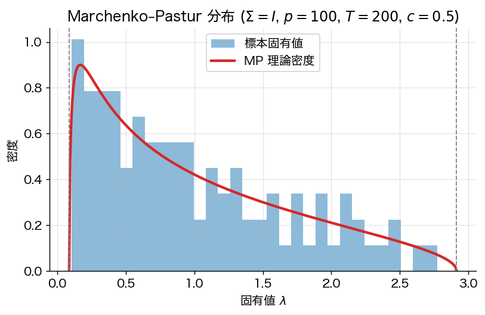
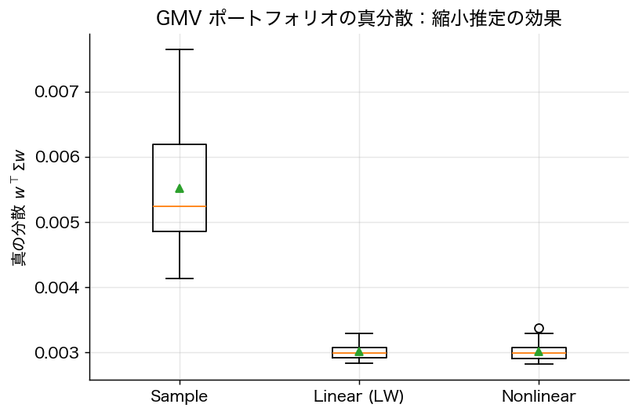

# 第12章 共分散行列の縮小推定と高次元漸近

## 12.1 大次元下の標本共分散行列の病理

Markowitz の最適化は $\Sigma^{-1}$ を要求する。実務では母共分散 $\Sigma$ を観測できないので、$T$ 期間の標本 $R_1, \dots, R_T$ から **標本共分散行列**
$$
S = \frac{1}{T-1} \sum_{t=1}^T (R_t - \bar R)(R_t - \bar R)^\top
$$
を用いる。古典的統計では $p$（資産数）固定で $T \to \infty$ なら $S \to \Sigma$（Wishart の一致性）。しかし実務では $p$ と $T$ が同程度のオーダー、典型的には $p/T \approx 0.5$–$2.0$。この **大次元** 領域では破綻が起こる。

**事実 12.1**（Marčenko–Pastur 1967）
$\Sigma = I_p$（真の共分散が単位行列）、$p/T \to c \in (0, \infty)$ のとき、$S$ の固有値の経験分布は
$$
\mathrm{MP}_c(d\lambda) = \frac{\sqrt{(\lambda_+ - \lambda)(\lambda - \lambda_-)}}{2\pi c \lambda} \mathbf{1}_{[\lambda_-, \lambda_+]} d\lambda
$$
（$\lambda_\pm = (1 \pm \sqrt c)^2$）に収束する。

すなわち $\Sigma = I$ でも標本固有値は $[\lambda_-, \lambda_+]$ に **広がる**。$c = 0.5$ では固有値範囲 $[(1-\sqrt{0.5})^2, (1+\sqrt{0.5})^2] = [0.086, 2.914]$。最小固有値 $\approx 0.086$ がほぼゼロに張り付き、$S^{-1}$ がこの方向に **爆発** する。



## 12.2 線形縮小推定（Ledoit–Wolf 2004）

**戦略**：$S$ と「単純な目標行列」$F$ の凸結合
$$
\hat\Sigma^{\rm LW}(\alpha) = (1 - \alpha)\, S + \alpha\, F, \qquad \alpha \in [0, 1]
$$
を取り、$\alpha$ を最適化する。原典では $F = \mu I_p$、$\mu = \mathrm{tr}(\Sigma)/p$（平均固有値の倍数）。

**定理 12.2**（Ledoit–Wolf 2004、JMVA 88: 365–411）
Frobenius ノルム損失
$$
L(\alpha) = \mathbb{E}\bigl[ \| \hat\Sigma^{\rm LW}(\alpha) - \Sigma \|_F^2 \bigr]
$$
を最小化する **oracle 最適縮小強度** は
$$
\alpha^\star = \frac{\sum_{i,j} \mathrm{Var}(S_{ij})}{\sum_{i,j} \mathrm{Var}(S_{ij}) + \| \Sigma - \mu I \|_F^2}.
$$
標本から推定可能な $\hat\alpha$ が $\alpha^\star$ に大次元漸近 $p/T \to c \in (0,\infty)$ で一致する。

*証明方針*：
- 損失を展開 $L(\alpha) = \alpha^2 \|S - \mu I - (S - F)\text{(deterministic)}\|^2$ 等の項に分解。
- バイアス–分散分解より $L(\alpha) = (1-\alpha)^2 \cdot \mathrm{Var}\text{項} + \alpha^2 \cdot \mathrm{Bias}\text{項}$。
- 一階条件から $\alpha^\star$。
- 4次モーメントから $\sum \mathrm{Var}(S_{ij})$ を一致推定。$\square$

**重要 caveat**（査読者目線）：
- 大次元漸近では $\hat\Sigma^{\rm LW}$ は **真の $\Sigma$ の各成分** に一致しない。一致するのは **oracle 縮小強度** $\alpha^\star$。
- $F = \mu I$ は等方目標、より sophisticated な目標（定数相関、因子モデル）も使える。

## 12.3 非線形縮小（Ledoit–Wolf 2012）

線形縮小は全固有値を一様に縮小する。**非線形縮小** は各固有値を個別に処理する。

**問題**：固有分解 $S = V \Lambda V^\top$（$\Lambda = \mathrm{diag}(\lambda_1, \dots, \lambda_p)$）。目標は固有値変換 $\tilde\Lambda = \mathrm{diag}(\tilde\lambda_1, \dots, \tilde\lambda_p)$ で
$$
\hat\Sigma^{\rm NL} = V \tilde\Lambda V^\top
$$
を構成し、Frobenius 損失 $\|\hat\Sigma^{\rm NL} - \Sigma\|_F^2$ を最小化すること。

**定理 12.3**（Ledoit–Wolf 2012, Ann. Statist. 40: 1024–1060）
$p/T \to c \in (0, 1)$ で、oracle 最適非線形縮小は
$$
\tilde\lambda_i^\star = \frac{\lambda_i}{|1 - c - c\, \lambda_i\, m(\lambda_i)|^2}
$$
（$m$ は経験スペクトル分布の Stieltjes 変換）で与えられ、これが推定可能な $\hat{\tilde\lambda}_i$ で漸近的に達成される。

*証明方針*：自由確率論（free probability）の S-変換、Marčenko–Pastur 分布の Stieltjes 変換による真スペクトル復元、極限定理。$\square$

**RMT cleaning**（Bun–Bouchaud–Potters 2017, Physics Reports 666: 1–109）：物理学者コミュニティでは同じアイデアを「相関行列のクリーニング」と呼ぶ。$N \to \infty, T/N \to q$ で、観測固有値 $\lambda$ の真値推定
$$
\xi(\lambda) = \frac{\lambda}{|1 - q + q z s(z)|^2} \bigg|_{z = \lambda - i0^+}
$$
（$s$ は Stieltjes 変換）。Ledoit–Wolf 2012 と本質的に等価な公式である。

## 12.4 因子モデルベースの縮小

ファクター構造 $\Sigma = B \Omega B^\top + D$ を仮定するなら、推定パラメタ数が $\mathcal{O}(p^2)$ から $\mathcal{O}(pK)$ に減る（第5章 5.5 節）。これは Fama–French 等の経済理論をもつ **構造的縮小** と解釈できる。Ledoit–Wolf の **constant correlation** 目標
$$
F_{ij} = \begin{cases} s_{ii} & i = j \\ \bar\rho \cdot \sqrt{s_{ii} s_{jj}} & i \neq j \end{cases}
$$
（$\bar\rho$ は平均標本相関）も実用上効果的（Ledoit–Wolf 2003, "Improved Estimation of the Covariance Matrix of Stock Returns"）。

## 12.5 Minimum Variance Portfolio への効果

GMV ポートフォリオ $w^{\rm GMV} = \Sigma^{-1} \mathbf{1} / (\mathbf{1}^\top \Sigma^{-1} \mathbf{1})$ について、$S$ で代用すると out-of-sample 分散が著しく増加する。Ledoit–Wolf 縮小は、極端なロングショート（$|w_i|$ が大きい）を抑制し、out-of-sample で **より低い実現分散** を達成することが繰り返し実証されている（DeMiguel–Garlappi–Uppal 2009, *RFS* 22: 1915–1953）。

**実証的事実**：1/N ナイーブ等加重と Markowitz（$S$ 推定）を比較すると、多くの実証で **1/N が勝つ**。Ledoit–Wolf 縮小を使った Markowitz は 1/N と互角〜やや優位。これが「単純なものほど頑健」という Markowitz の実装上の困難を端的に示す。



## 12.6 実装の要点

```python
# Ledoit-Wolf 線形縮小（scikit-learn 実装）
from sklearn.covariance import LedoitWolf
lw = LedoitWolf().fit(returns)
Sigma_hat = lw.covariance_
alpha_hat = lw.shrinkage_  # 推定された縮小強度
```

## 12.7 まとめ

- 大次元下で標本共分散は固有値分布が病的に広がる（Marčenko–Pastur）。
- 線形縮小は **oracle 縮小強度** を一致推定する強力な手法。
- 非線形縮小は各固有値を個別最適化、RMT cleaning と等価。
- 因子モデルは経済理論をもつ構造的縮小として捉えられる。
- 1/N ナイーブと比べた優位性は実証データに依存し、**縮小を入れないと負ける** ことが多い。

---
[← 第11章](11_performance_evaluation.md) ｜ [次章 → 第13章 ロバスト/分布ロバスト最適化](13_robust_optimization.md)
