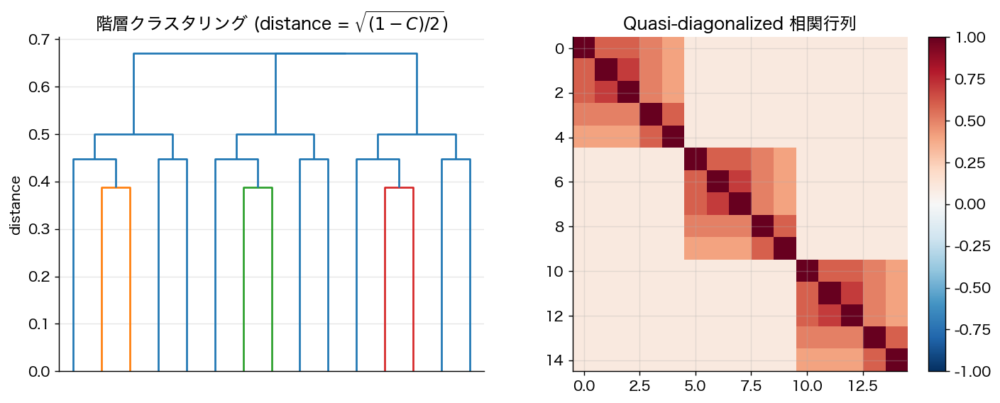

# 第14章 リスクパリティと階層的リスクパリティ（HRP）

Markowitz 流の平均分散最適化は期待リターン $\mu$ の推定誤差に致命的に弱い。**リスクパリティ** は期待リターンを完全に放棄し、**リスク寄与の均等化** だけを基準とする。

## 14.1 リスク寄与の定義

ポートフォリオ全体の標準偏差 $\sigma_P(w) = \sqrt{w^\top \Sigma w}$ は資産重み $w$ の **1 次同次** 関数。Euler の定理から
$$
\sigma_P(w) = \sum_i w_i \cdot \frac{\partial \sigma_P}{\partial w_i}.
$$

**定義 14.1**（限界リスク寄与・リスク寄与）
$$
\mathrm{MRC}_i := \frac{\partial \sigma_P}{\partial w_i} = \frac{(\Sigma w)_i}{\sqrt{w^\top \Sigma w}},\qquad \mathrm{RC}_i := w_i \cdot \mathrm{MRC}_i = \frac{w_i (\Sigma w)_i}{\sigma_P(w)}.
$$
$\sum_i \mathrm{RC}_i = \sigma_P(w)$（Euler 分解）が成立。

## 14.2 Equal Risk Contribution（ERC）

**定義 14.2**（ERC ポートフォリオ）
全資産のリスク寄与が等しい：
$$
\mathrm{RC}_i = \frac{\sigma_P(w)}{n}, \quad i = 1, \dots, n.
$$
あるいは等価に $w_i (\Sigma w)_i = w_j (\Sigma w)_j$ for all $i, j$。

### 14.2.1 対角共分散の場合

$\Sigma = \mathrm{diag}(\sigma_1^2, \dots, \sigma_n^2)$ なら $\mathrm{RC}_i \propto w_i^2 \sigma_i^2$。等寄与条件 $w_i \sigma_i = $ const から
$$
\boxed{\;
w_i^{\rm ERC} = \frac{1/\sigma_i}{\sum_j 1/\sigma_j} \quad (\sigma_i \text{ は標準偏差})
\;}
$$

**注**：$\sigma_i$ を **分散** と呼ぶ書物もあるので注意。本書では一貫して $\sigma_i$ は標準偏差。

### 14.2.2 二資産の場合

相関 $\rho$ の二資産では、ERC 解は驚くべきことに **相関に依存しない**：
$$
w_1^{\rm ERC} = \frac{\sigma_2}{\sigma_1 + \sigma_2}, \quad w_2^{\rm ERC} = \frac{\sigma_1}{\sigma_1 + \sigma_2}.
$$

*証明方針*：等寄与条件 $w_1 (\Sigma w)_1 = w_2 (\Sigma w)_2$ を展開し、$\rho \sigma_1 \sigma_2 w_1 w_2$ 項が両辺に現れて相殺。$\square$

### 14.2.3 一般 $\Sigma$：存在性と一意性

**定理 14.3**（Maillard–Roncalli–Teiletche 2010, *JPM* 36(4): 60–70）
$\Sigma \succ 0$ かつ長オンリー（$w > 0$）制約下で、ERC ポートフォリオは存在し一意に決まる。

*証明方針*（Bai–Scheinberg–Tütüncü 2016, *J. Optim. Theory Appl.* 168: 1–28）：
- 凸プログラム
$$
\min_{y > 0} \frac{1}{2} y^\top \Sigma y - \sum_i \log y_i
$$
を解くと最適 $y^\star$ から $w_i^{\rm ERC} = y_i^\star / \sum_j y_j^\star$。
- 目的関数は強凸（$-\sum \log y_i$ は強凸、$\Sigma \succ 0$）。
- 一階条件 $\Sigma y = \mathrm{diag}(1/y_1, \dots, 1/y_n) \mathbf{1}$ より $y_i (\Sigma y)_i = 1$、正規化して ERC 条件と一致。$\square$

**caveat**：ショート可・特異 $\Sigma$・追加制約付きでは一意性が崩れる。

## 14.3 リスクパリティの実証性質

Asness–Frazzini–Pedersen 2012（*Financial Analysts Journal* 68: 47–59）は「low-risk anomaly + レバレッジ回避」によりリスクパリティが Sharpe を改善することを示した。実務的に Bridgewater の All Weather や AQR の Risk Parity Fund などが採用。

**ただし**：
- リスクパリティはレバレッジを要する（債券側にレバ）→ 借入金利・流動性リスク。
- 「リスクが均等」≠「真に分散」。例えば全資産が高相関ならリスク寄与が均等でも単一因子に集中。
- 2008・2020 の市場ストレスでは相関上昇により分散効果が失われた。

## 14.4 階層的リスクパリティ（HRP, López de Prado 2016）

López de Prado 2016（*JPM* 42(4): 59–69）は標本共分散の特異性問題を回避する三段階アルゴリズム HRP を提案。

### 14.4.1 アルゴリズム

**Step 1: Tree clustering**
相関行列 $C$ から **距離行列**
$$
d_{ij} = \sqrt{\frac{1 - C_{ij}}{2}} \in [0, 1]
$$
を作る。$d$ は metric（三角不等式を満たす、Mantegna 1999）。階層クラスタリング（典型的に **single linkage**）でデンドログラムを構築。

**Step 2: Quasi-diagonalization**
クラスタの順序で資産を並び替え、相関行列をブロック対角に近づける。$\Sigma$ そのものは触らないが、後段の bisection 順序を決める。

**Step 3: Recursive bisection**
全資産に重み 1 を初期化、並び替え順序のリストを再帰的に二分割：

```
function HRP_alloc(weights, items):
    if len(items) == 1: return
    L, R = split items in half
    σ²_L = v_L^T Σ_L v_L  where v_L_i ∝ 1/Σ_ii
    σ²_R = v_R^T Σ_R v_R  where v_R_i ∝ 1/Σ_ii
    α = σ²_R / (σ²_L + σ²_R)
    weights[L] *= α
    weights[R] *= (1 - α)
    HRP_alloc(weights, L)
    HRP_alloc(weights, R)
```

各ステップで二資産問題 $\min_\alpha \alpha^2 \sigma_L^2 + (1-\alpha)^2 \sigma_R^2$ の最小化（解 $\alpha = \sigma_R^2/(\sigma_L^2 + \sigma_R^2)$）として導出される。

### 14.4.2 HRP の利点（López de Prado の主張）

- **$\Sigma^{-1}$ を使わない** → 特異・悪条件共分散に頑健。
- 階層構造が経済的にも意味を持つ（業界クラスタ等）。
- 計算量 $\mathcal{O}(n \log n)$ で大規模問題に向く。

### 14.4.3 査読者の警告：HRP は本当に out-of-sample で勝つのか

López de Prado 2016 の優位主張は主に Monte Carlo に依存し、実データでの普遍的優位は確立されていない。

- **Jain–Jain (2019)**: 粗い共分散推定では inverse-volatility が最も頑健、HRP は中間的。HRP が常に勝つわけではない。
- **Pfitzinger–Katzke (2019)**: HRP の弱点を補う Constrained HRP (CHRP) を提案。素の HRP に実務上の不足があることを暗黙に認める。
- **比較対象の脆弱性**：CLA（Critical Line Algorithm）と HRP の比較で CLA は標本共分散を直接使う最弱の Markowitz。LW 縮小入りの GMV や ERC との比較ではないため、優位性の主張は割り引いて読むべき。

**結論**：HRP は「便利な heuristic」として教えるべきで、厳密な最適性主張はしない。



## 14.5 ERC vs Markowitz vs HRP

実証上の経験則（DeMiguel–Garlappi–Uppal 2009 以来）：

| 手法 | $\mu$ 推定 | $\Sigma$ 推定 | 必要レバ | OOS Sharpe |
|------|----------|------------|--------|------------|
| 1/N | 不要 | 不要 | なし | 高い（驚くほど） |
| Markowitz（$S$） | 重要 | 重要 | 大 | 不安定 |
| GMV（$S$） | 不要 | 重要 | 中 | 不安定 |
| GMV + LW 縮小 | 不要 | 軽減 | 中 | 良好 |
| ERC | 不要 | 軽 | 中 | 良好 |
| HRP | 不要 | 軽 | 中 | 良好だが状況依存 |

実証上、$\mu$ 推定を必要としない手法群（GMV、ERC、HRP）が比較的安定。Markowitz そのものは縮小推定なしには「実装するな」とまで言われる（Michaud 1989, "Markowitz Optimization Enigma"）。

## 14.6 まとめ

- ERC はリスク寄与均等化で、対角 $\Sigma$ では $w \propto 1/\sigma$。二資産では相関に依存しない。
- 一般の ERC は凸プログラム $\min_y \tfrac{1}{2} y^\top \Sigma y - \sum \log y_i$ の最適化に等価。
- HRP は階層クラスタリング + 再帰的二分割の heuristic。$\Sigma^{-1}$ を避けるが、共分散・距離・linkage への依存性は残る。
- HRP の OOS 優位性は contested。教えるなら caveat 付きで。
- 実証上は「$\mu$ 推定を必要としない」手法群が一般に安定。

---
[← 第13章](13_robust_optimization.md) ｜ [次章 → 第15章 因子動物園と機械学習](15_factor_zoo_ml.md)
