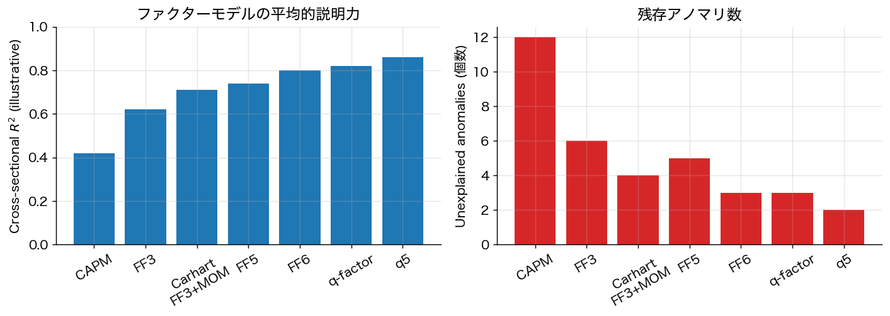

# 第15章 ファクター動物園・FF5・q ファクター・機械学習資産価格

第5章で Fama–French 3 因子と Carhart 4 因子モデルを導入したが、2010 年以降この分野は **多重検定の認識** と **機械学習の流入** で大きく変容した。

## 15.1 Fama–French 5 因子モデル（FF5）

Fama–French 2015（*JFE* 116(1): 1–22）は HML, SMB に加え **収益性（RMW: Robust Minus Weak）** と **投資保守度（CMA: Conservative Minus Aggressive）** の二因子を追加。

$$
R_i - r_f = \alpha_i + b_i \cdot \mathrm{MKT} + s_i \cdot \mathrm{SMB} + h_i \cdot \mathrm{HML} + r_i \cdot \mathrm{RMW} + c_i \cdot \mathrm{CMA} + \varepsilon_i.
$$

**理論的根拠**：配当割引モデルの恒等式
$$
\frac{P_t}{B_t} = \frac{\sum_\tau \mathbb{E}_t[\text{利益}_{t+\tau}]/(1 + r)^\tau}{B_t}
$$
を整理すると、期待リターン $r$ は **B/M, 期待利益、期待投資成長率** の関数になる。これが「価値・収益性・投資」の三因子論を動機付ける。

**Fama–French 自身が認めた弱点**：
1. **HML の冗長性**：FF5 内では HML が RMW と CMA に説明される。価値ファクターの「勝利」ではなく「吸収」。
2. **モメンタムの未説明**：FF5 もモメンタムを説明できない。Fama–French 2016（*RFS* 29: 69–103）は FF6（モメンタム追加版）を後に提案。
3. **小型成長株の異常リターン**：低収益・積極投資の小型株の低リターンを捕まえきれない。

## 15.2 Hou–Xue–Zhang の q ファクターモデル

Hou–Xue–Zhang 2015（*RFS* 28: 650–705）は投資理論（Tobin's q）から導出された 4 因子モデル：

- $\mathrm{R}_{MKT}$: 市場
- $\mathrm{R}_{ME}$: サイズ（FF SMB に対応）
- $\mathrm{R}_{IA}$: 投資（CMA に近い）
- $\mathrm{R}_{ROE}$: 収益性（RMW に近い）

**Hou–Mo–Xue–Zhang 2019（*Review of Finance* 23: 1–35）の結論**：q ファクターは FF5/FF6 の主要なアノマリを **spanning test** で吸収する。すなわち q ファクターを所与とすると、FF5 因子（HML, CMA, RMW）の超過リターンは大半消える。

**q5 モデル**（Hou et al. 2021, *Review of Finance* 25: 1–41）：q ファクターに **expected growth** を追加し、FF6 を上回ると主張。

**現代の状況**：「FF5 が決着済み標準」ではない。FF5、FF6、q-factor、q5 が競合する。実証選択はデータ・期間・サンプルセレクションに依存。

## 15.3 ファクター動物園と多重検定

Cochrane 2011（AFA Presidential Address, *Journal of Finance* 66: 1047–1108）の問題提起：**「factor zoo」** — 数百本の "新発見" アノマリが論文として publish されている。

### 15.3.1 Harvey–Liu–Zhu の警告

Harvey–Liu–Zhu 2016（*RFS* 29: 5–68）は 1967–2014 年に提案された **316 ファクター** をカタログ化し、多重検定補正後に「真に有意」と言えるものは少数だと示した。

**主張**：従来「$t > 2$」を有意の閾値としてきたが、多重検定下では正しくない。
- **Bonferroni 補正**：$N$ テストなら $|t| > \Phi^{-1}(1 - \alpha/(2N))$。$N = 316$, $\alpha = 0.05$ なら $|t| > 3.39$。
- **Holm 法**：順序付き $p$ 値に対する漸近的補正。
- **Benjamini–Hochberg（FDR 法）**：False Discovery Rate を制御。

ファクターの大多数は $|t| < 3$ で、多重検定後は **生き残らない**。

### 15.3.2 Feng–Giglio–Xiu（2020）の "Taming the Factor Zoo"

Feng–Giglio–Xiu 2020（*JF* 75: 1327–1370）は機械学習（**double machine learning**）で「真に新規な」ファクターを発見する手続きを提案。手順：

1. 既存 $K$ ファクターと候補新規ファクターを所与とする。
2. SDF（確率割引因子）の推定に既存ファクターを反映。
3. 新規ファクターの **増分** 寄与を Lasso 等で評価。
4. 多重検定補正下で増分有意なものだけ採用。

結果：多くの「新発見」は既存ファクターに吸収され、真に独立な新規因子は少数（10 個前後）。

## 15.4 機械学習資産価格

### 15.4.1 Gu–Kelly–Xiu（2020）：ML が古典モデルを凌駕

Gu–Kelly–Xiu 2020（*RFS* 33: 2223–2273）は数百の firm characteristics から多様な ML 手法（ニューラルネット、勾配ブースティング、ランダムフォレスト、Lasso）で月次リターンを予測。

**結果**：
- ニューラルネット（2–5 層）が最高性能、R^2 が線形モデル比 2–4 倍。
- 価値・モメンタムだけでなく、リターン予測において **流動性・取引摩擦・短期反転** が重要。
- 経済的に大きい長短ロング・ショート Sharpe（年率 2.5–3.0 程度）。

**重要 caveat**：
- 取引コスト・空売り制約・規模効果を考慮するとずっと小さくなる。
- 統計的予測力と取引可能な戦略は別。

### 15.4.2 Kelly–Pruitt–Su（2019）：Instrumented PCA（IPCA）

Kelly–Pruitt–Su 2019（*JFE* 134: 501–524）は **特性（characteristics）が因子負荷量に直接対応** する条件付き因子モデル：
$$
R_{i,t+1} = \beta_{i,t} \cdot f_{t+1} + \varepsilon_{i,t+1}, \qquad \beta_{i,t} = Z_{i,t} \Gamma + u_{i,t}
$$
（$Z_{i,t}$ は firm characteristics、$\Gamma$ は推定する負荷写像）。

これは「特性は β を時変させる」という形での **特性 = 共分散** 仮説。少数の因子（5–6 個）で多数のアノマリを説明することに成功。

### 15.4.3 Chen–Pelger–Zhu（2023）：Deep Learning + No-Arbitrage

Chen–Pelger–Zhu 2023（*Management Science* 70: 714–750）は **無裁定条件をニューラルネットに損失として組み込む**：
$$
\mathcal{L} = \sum_t \| \mathbb{E}_t[M_{t+1} R_{t+1}] - 1 \|^2 + \lambda \cdot \mathrm{NN\text{-}penalty}.
$$
これは APT を ML の枠組みで再構成した試み。

## 15.5 ML 資産価格の落とし穴

- **データスヌーピング**：何百もの特性から探したものは selection bias を含む。
- **構造変化（regime shift）**：訓練期間と異なる時期は予測力低下。
- **取引コスト**：高頻度回転戦略は実装困難。
- **解釈可能性**：ニューラルネット予測は経済的解釈が困難。SHAP/特徴量重要度等で部分的に分析可。
- **再現性**：データ前処理・サンプル選択・特性の定義が論文間で異なる。

## 15.6 まとめ

- FF5 は HML の冗長性とモメンタム未説明を内包。FF6 でも完全ではない。
- q ファクター（Hou–Xue–Zhang）は FF5 と競合。q5 で expected growth を追加。
- 数百のアノマリから「真に独立な」因子は数十個程度（Harvey–Liu–Zhu、Feng–Giglio–Xiu）。
- 多重検定補正が現代資産価格論の必須要件。
- 機械学習は予測力を向上させるが、取引可能性・解釈可能性・再現性に課題。

---
[← 第14章](14_risk_parity_hrp.md) ｜ [次章 → 第16章 バックテスト過剰適合と Deflated Sharpe](16_backtest_overfit.md)
