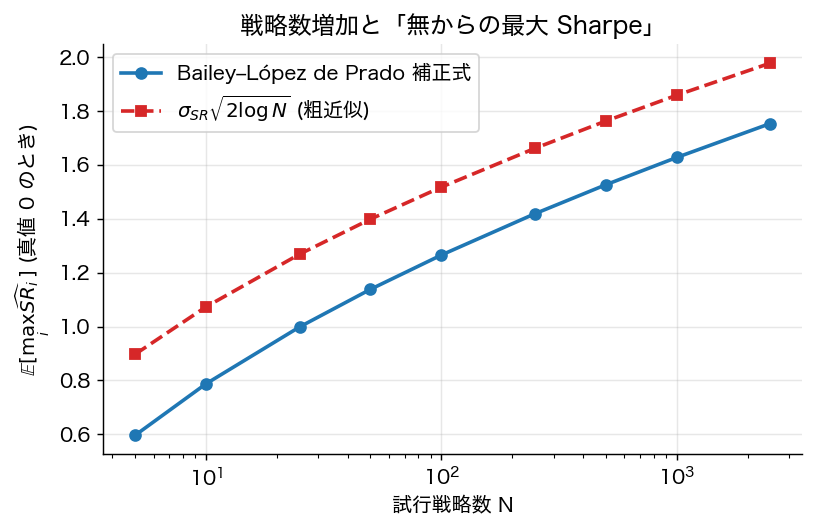

# 第16章 バックテスト過剰適合と Deflated Sharpe 比

第11章では Sharpe 比とその統計的検出力を扱った。本章では **複数戦略を比較した上で最良を選ぶ** という、実務でほぼ普遍的な状況下での評価バイアスを定量化する。

## 16.1 問題：選択バイアス

$N$ 個の独立戦略 $\{s_1, \dots, s_N\}$ から事後最良 $s^\star = \arg\max_i \widehat{\mathrm{SR}}_i$ を選ぶ。$s^\star$ の標本 Sharpe は **過大評価** される。

**極値理論からの近似**：$\widehat{\mathrm{SR}}_i \sim_{\rm iid} \mathcal{N}(0, \sigma_{\rm SR}^2)$ なら
$$
\mathbb{E}[\max_{i=1, \dots, N} \widehat{\mathrm{SR}}_i] \approx \sigma_{\rm SR} \sqrt{2 \log N}\quad (\text{Gumbel 近似のリーディング項}).
$$

より精緻には Euler–Mascheroni 補正を含む形式（Bailey–López de Prado 2014）：
$$
\mathbb{E}[\max_i \widehat{\mathrm{SR}}_i] \approx \bar{\mathrm{SR}} + \sigma_{\rm SR} \left[ (1 - \gamma_E)\, \Phi^{-1}\!\left(1 - \tfrac{1}{N}\right) + \gamma_E \Phi^{-1}\!\left(1 - \tfrac{1}{N e}\right) \right]
$$
（$\gamma_E \approx 0.5772$）。$N$ が大きいと両式は近い値を与える。

**重要 caveat**（査読者目線）：
- $\sqrt{2 \log N}$ は **iid 正規** の最大値の漸近近似。実戦略は **相関** している、しかも **連続ハイパーパラメタ空間** で探索するため「実効 $N$」は不明。
- リターンが正規でない（重尾・歪度）、自己相関を持つ、標本長 $T_i$ が戦略間で異なると近似が崩れる。
- 「報告された $N$」と「実際に試した $N$」は通常乖離。隠れた backtest が無数に存在する。

## 16.2 Deflated Sharpe Ratio (DSR)

Bailey–López de Prado 2014（*JPM* 40(5): 94–107）の **Deflated Sharpe Ratio**：

**定義 16.1**（DSR）
$$
\boxed{\;
\widetilde{\mathrm{SR}} = \Phi\!\left( \frac{(\widehat{\mathrm{SR}} - \mathrm{SR}^\star) \sqrt{T - 1}}{\sqrt{1 - \gamma_3 \widehat{\mathrm{SR}} + \tfrac{\gamma_4 - 1}{4} \widehat{\mathrm{SR}}^2}}\right)
\;}
$$
ここで $\mathrm{SR}^\star = \mathbb{E}[\max_i \mathrm{SR}_i]$（試行数 $N$ から導出）、$\gamma_3, \gamma_4$ はリターンの歪度・尖度、$T$ は標本長。

**解釈**：$\widetilde{\mathrm{SR}}$ は「真の Sharpe が選択前の基準値 $\mathrm{SR}^\star$ を超える確率」。$\widetilde{\mathrm{SR}} > 0.95$ なら統計的に「本物の skill」と主張可能。

**数値例**：
- 標本 Sharpe = 1.5、$N = 100$ 戦略、$\bar{\mathrm{SR}} = 0$, $\sigma_{\rm SR} = 0.5$。
- $\Phi^{-1}(0.99) = 2.326$, $\Phi^{-1}(1 - 1/(100 e)) \approx 2.68$
- $\mathrm{SR}^\star \approx 0.5 \cdot [(1 - 0.577) \cdot 2.326 + 0.577 \cdot 2.68] \approx 1.26$
- 標準誤差項を簡略化して $\widetilde{\mathrm{SR}} \approx \Phi(0.48) \approx 0.68$
- すなわち **「本物の skill」と統計的に主張できない**

## 16.3 バックテスト過剰適合（PBO）

Bailey–Borwein–López de Prado–Zhu 2017（*J. Computational Finance* 20: 39–69）は **Probability of Backtest Overfitting (PBO)** を提案：

**定義 16.2**（PBO）
$$
\mathrm{PBO} := P\bigl(\,\text{IS でランク 1 の戦略が OOS で中央値以下になる}\,\bigr).
$$

**Combinatorially Symmetric Cross-Validation (CSCV)** で推定：
1. データを $S$ 個（偶数）のブロックに分割。
2. $\binom{S}{S/2}$ 通りの分割（半分が IS、半分が OOS）について、IS で各戦略の Sharpe を計算し最良を選ぶ。
3. その戦略の OOS Sharpe ランクを記録。
4. ランクが中央値以下になる割合が PBO。

**経験則**：典型的な金融バックテストで $\mathrm{PBO} \in [0.4, 0.7]$ という驚くべき高さ。半数以上の「優勝戦略」は OOS で平凡以下。

## 16.4 多重検定の正しい枠組み

第15章で導入した多重検定補正は backtest 評価でも有効：

- **Bonferroni**：family-wise error rate（FWER）制御。$N = 100$ 戦略なら $\alpha/N = 0.0005$、$|t| > 3.48$。
- **Holm 法**：step-down 順序付き。Bonferroni より検出力高。
- **Benjamini–Hochberg（BH）法**：False Discovery Rate（FDR）制御。検出力がさらに高い。

実務では **戦略数 $N$ が観測不能** な点が最大の難点。Harvey–Liu–Zhu（2016）が指摘した通り、未報告の backtest を含めれば実効 $N$ は文献値より遥かに大きい。

## 16.5 機械学習バックテストの落とし穴

- **ハイパーパラメタ探索**：grid search で数百〜数万通り試す。実効 $N$ は爆発。
- **Walk-forward validation**：データ分割・リサンプリングの順序依存性。
- **Look-ahead bias**：未来情報の漏洩。特に特性のラグ処理を間違える。
- **Survivorship bias**：上場廃止銘柄の脱落で過大評価。
- **データの再加工**：CRSP/Compustat の特性値が遡及的に改訂されている場合がある。

## 16.6 健全なバックテストの設計指針

López de Prado *Advances in Financial Machine Learning* (2018) で推奨：

1. **Embargo + Purging**：時系列分割で IS/OOS の隣接バーを排除し情報漏洩を防ぐ。
2. **Combinatorial Purged Cross-Validation (CPCV)**：時系列での頑健な CV。
3. **試行記録**：探索したすべてのモデルを記録し $N$ を honest にカウント。
4. **DSR/PBO 計算**：報告する前に必須。
5. **Out-of-time hold-out**：絶対に触らないデータを最後の検証用に残す。

## 16.7 まとめ

- 多戦略から最良を選ぶと標本 Sharpe は選択バイアスを受ける。
- $\sqrt{2 \log N}$ は最大値の漸近近似だが、現実条件（相関、非正規、不明な $N$）下では粗近似。
- DSR は標本 Sharpe を「skill 確率」に変換する診断指標。
- PBO は「IS 優勝が OOS で凡庸化する確率」、実証的に 40–70% と高い。
- バックテストには purging/embargo、honest な試行カウント、out-of-time hold-out が必須。

---
[← 第15章](15_factor_zoo_ml.md) ｜ [次章 → 第17章 演習問題](17_exercises.md)
