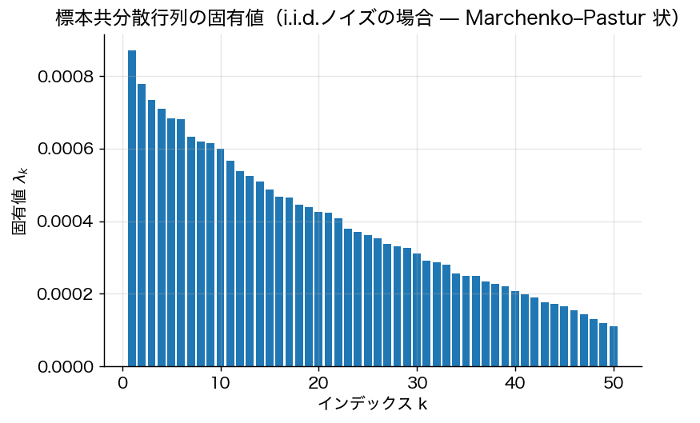

# 第0章 記号と準備

> 🎯 **この章で答える問い**
> - リターンを **ベクトル・行列で書く** と何が嬉しいか。
> - 「分散共分散行列が正定値」とは何を意味するのか。
> - **ラグランジュ未定乗数法** はなぜ平均分散最適化の中心道具なのか。
>
> 📐 **前提知識チェック**
> - 行列と転置（$A^\top$、$AB$ の計算）
> - 固有値・固有ベクトル（$Av = \lambda v$）
> - 期待値と分散の線形性
> - 多変数関数の偏微分とラグランジュ未定乗数法
>
> 🔑 **主要記号**：$R$ リターンベクトル、$\mu = \mathbb{E}[R]$、$\Sigma = \mathrm{Cov}(R)$、$w$ ポートフォリオ重み、$\mathbf{1} = (1, \dots, 1)^\top$、$r_f$ 無リスク利子率。

## 0.1 ベクトル・行列の基本

$n$ 種類の危険資産が市場に存在するとし、各資産 $i$ の確率的なリターンを $R_i$ で表す。リターンベクトル $R = (R_1, \dots, R_n)^\top$ について

$$
\mu := \mathbb{E}[R] \in \mathbb{R}^n, \qquad \Sigma := \mathrm{Cov}(R) = \mathbb{E}[(R-\mu)(R-\mu)^\top] \in \mathbb{R}^{n\times n}
$$

を定義する。$\Sigma$ は対称半正定値であり、本書では特に断りがない限り **正定値（$\Sigma \succ 0$）** を仮定する（資産間に完全な線形従属がない、という非縮退条件に対応）。

ポートフォリオは重みベクトル $w \in \mathbb{R}^n$ で表し、ポートフォリオリターンは

$$
R_w := w^\top R, \qquad \mathbb{E}[R_w] = w^\top \mu, \qquad \mathrm{Var}(R_w) = w^\top \Sigma w.
$$

完全投資制約は $\mathbf{1}^\top w = 1$、ショート禁止制約は $w \ge 0$ である。

## 0.2 正定値行列に関する補題

**補題 0.1**（コーシー・シュワルツ型不等式）
$\Sigma \succ 0$ のとき、任意の $x, y \in \mathbb{R}^n$ に対し
$$
(x^\top \Sigma y)^2 \le (x^\top \Sigma x)(y^\top \Sigma y),
$$
等号は $x$ と $y$ が線形従属のとき。

*証明方針*：$\langle x, y\rangle_\Sigma := x^\top \Sigma y$ は $\Sigma \succ 0$ より内積となるため、通常のコーシー・シュワルツが適用できる。$\square$

**補題 0.2**
$\Sigma \succ 0$ ならば $\Sigma^{-1}$ も対称正定値であり、二次形式 $f(w) = \tfrac{1}{2} w^\top \Sigma w$ は狭義凸である。

## 0.3 制約付き二次計画

平均分散分析の中核は次の問題である。

$$
\min_{w \in \mathbb{R}^n} \quad \tfrac{1}{2}\, w^\top \Sigma w \quad \text{s.t.} \quad A w = b
$$

ここで $A \in \mathbb{R}^{m \times n}$（$m \le n$、$A$ は行フルランク）、$b \in \mathbb{R}^m$。

**定理 0.3**（一般二次計画の解）
最適解は一意に
$$
w^\star = \Sigma^{-1} A^\top (A \Sigma^{-1} A^\top)^{-1} b
$$
で与えられる。

*証明方針*：Lagrangian $L(w, \lambda) = \tfrac{1}{2} w^\top \Sigma w - \lambda^\top (Aw - b)$ について $\partial_w L = 0$ より $w = \Sigma^{-1} A^\top \lambda$、これを制約 $Aw = b$ に代入して $\lambda$ を解き、再代入する。$\Sigma$ 正定値より目的関数は狭義凸、よって停留点が唯一の大域最小。$\square$

この公式は **第2章で効率的フロンティアの閉形表現** を導く際に繰り返し用いられる。

## 0.4 凸性・期待効用に向けた補題

**Jensen の不等式**：$u$ が凹関数のとき $\mathbb{E}[u(X)] \le u(\mathbb{E}[X])$。等号は $X$ が定数のとき（$u$ が狭義凹ならば）。

**確率変数の絶対連続変換**：密度 $p$ を持つ $X$ に対し $Y = g(X)$ の密度は変数変換公式で得られる。リスク尺度の章で用いる。

## 0.5 確率過程の最小限の準備（第10章で詳述）

- 標準ブラウン運動 $W_t$、Itô 積分、Itô の公式
- 幾何ブラウン運動：$dS_t = \mu S_t \, dt + \sigma S_t \, dW_t$
- 動的計画原理と Hamilton–Jacobi–Bellman 方程式

これらは該当章で再導入する。

## 0.6 数学補足ボックス（本書を通して使うミニ復習）

### 📐 数学補足 box：ラグランジュ未定乗数法

制約 $g(x) = 0$ の下で $f(x)$ を最大化したいとき、ラグランジアン
$$
L(x, \lambda) = f(x) - \lambda \cdot g(x)
$$
を作り、$\partial L / \partial x = 0$, $\partial L / \partial \lambda = 0$ を解けばよい。複数制約 $g_1(x) = 0, \dots, g_m(x) = 0$ なら乗数も $\lambda_1, \dots, \lambda_m$ と複数になる。

**直観**：制約面上で停留点であるためには、$f$ の勾配が制約の勾配の線形結合に等しくなければならない。乗数 $\lambda$ は「制約を 1 単位緩めたときの目的関数の改善量」（**シャドウプライス**）として解釈できる。

平均分散最適化では $f = -\tfrac{1}{2}w^\top \Sigma w$（最小化なので符号は逆）、制約は $w^\top \mu = \mu_P$、$\mathbf{1}^\top w = 1$ の 2 本。

### 📐 数学補足 box：行列の正定値性が意味すること

対称行列 $A$ が **正定値** とは、すべての非零ベクトル $x$ で $x^\top A x > 0$ となること。同値な条件：

1. 固有値がすべて正
2. 逆行列 $A^{-1}$ が存在し、これも正定値
3. Cholesky 分解 $A = L L^\top$（$L$ は下三角行列）が存在

**金融的意味**：共分散行列 $\Sigma$ の正定値性は「**どのポートフォリオを組んでも分散が必ず正**」、すなわち「リスクゼロを実現する非自明なポートフォリオは存在しない」ことを意味する。資産間に完全な裁定機会がない条件と密接に関係する。

### 📐 数学補足 box：Euler の同次関数定理

$f(\lambda x) = \lambda^k f(x)$ を満たす関数を **$k$ 次同次** と呼ぶ。$k = 1$（1 次同次）なら
$$
f(x) = \sum_i x_i \frac{\partial f}{\partial x_i}.
$$

**応用**：ポートフォリオ標準偏差 $\sigma_P(w) = \sqrt{w^\top \Sigma w}$ は重み $w$ について 1 次同次。よって
$$
\sigma_P(w) = \sum_i w_i \frac{\partial \sigma_P}{\partial w_i}
$$
と **リスク寄与の和** に分解できる。第14章のリスクパリティの基礎となる。

---
[次章 → 第1章 Markowitz の平均分散分析](01_markowitz_basics.md)
