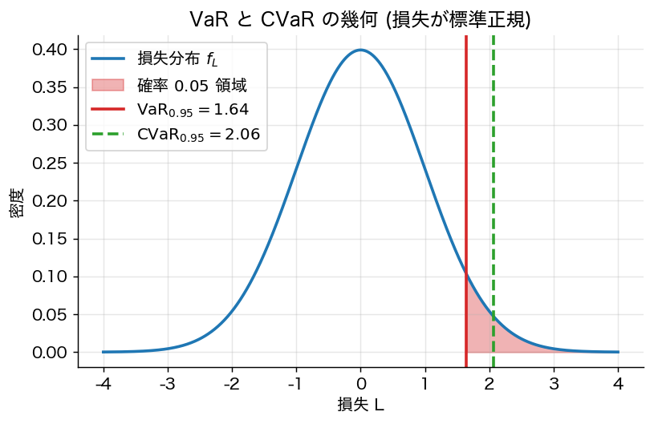
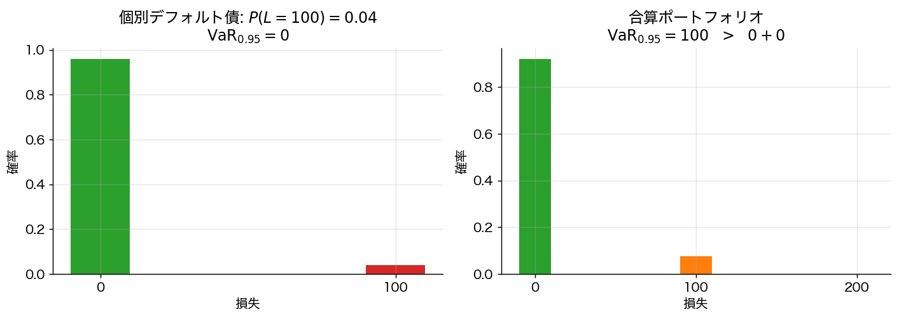

# 第8章 リスク尺度

> 🎯 **この章で答える問い**
> - 「リスク」を **標準偏差以外** で測る理由は何か。
> - 銀行・保険会社が使う **VaR** はなぜ批判されたのか。
> - **CVaR (Expected Shortfall)** はなぜ規制で標準になったのか。
>
> 📐 **使う数学**：分位点・確率分布の裾、期待値の線形性。
>
> 🔑 **主要結果**：VaR は劣加法性を欠くため分散投資をペナルティしうるが、CVaR は劣加法性を満たし「**合理的なリスク尺度**」（Artzner 公理）として規制で標準になった。

## 8.1 リスク尺度とは何か

リスク尺度 $\rho$ は損失分布 $L$ に実数 $\rho(L)$ を対応させる写像。標準偏差はその一例だが、

- 損失の **左裾（テールリスク）** に十分敏感でない
- 対称な指標であり「損益の非対称性」を捉えない
- 規制目的では **必要資本量** の解釈が直接できない

これらの欠点を補うのが本章のテーマである。

## 8.2 Value-at-Risk (VaR)

**定義 8.1**
損失 $L$ の信頼水準 $\alpha \in (0, 1)$ における VaR は
$$
\mathrm{VaR}_\alpha(L) := \inf\{ x \in \mathbb{R} : P(L > x) \le 1 - \alpha\} = F_L^{-1}(\alpha)
$$
通常 $\alpha = 0.95$ や $0.99$。

**バーゼル規制等で長年標準だった**。しかし以下の欠点を持つ。

## 8.3 VaR の問題点：非劣加法性

**事実 8.2**
VaR は一般に **劣加法性**（$\rho(L_1 + L_2) \le \rho(L_1) + \rho(L_2)$）を満たさない。すなわち分散投資により VaR が悪化することがある。

**反例（独立性を仮定）**：**独立** な 2 つのデフォルト債を考える。各々 $P(\text{損失}=100) = 0.04$、$P(0) = 0.96$。$\alpha = 0.95$ で個別 VaR はいずれも 0。しかし合算 $L_1 + L_2$ の損失分布は $P(L=200) = 0.0016$, $P(L=100) = 2 \cdot 0.04 \cdot 0.96 = 0.0768$, $P(L=0) = 0.9216$。よって $\mathrm{VaR}_{0.95}(L_1 + L_2) = 100 > 0 + 0 = \mathrm{VaR}(L_1) + \mathrm{VaR}(L_2)$。

これは「分散投資をペナルティする」異常な振る舞いで、合理的なリスク管理に反する。

> ⚠️ **実務注意 box：周辺分布だけでは VaR の合算は決まらない**
>
> 上の反例は **独立** を仮定した。$L_1, L_2$ の同時分布（相関や依存関係）が変わると、$L_1 + L_2$ の分布も変わり、合算 VaR の値も変わる。「個別資産の VaR だけからポートフォリオの VaR は計算できない」というのが、現代リスク管理の出発点である。一般に依存構造は **コピュラ** という道具で記述される（学部生は名前を覚えておけば十分）。

## 8.4 コヒーレントリスク尺度（Artzner et al. 1999）

**定義 8.3**（コヒーレントリスク尺度）
$\rho$ が次の四公理を満たすとき：
1. **単調性**：$L_1 \le L_2$ a.s. $\Rightarrow \rho(L_1) \le \rho(L_2)$
2. **平行移動不変性**：$\rho(L + c) = \rho(L) + c$（$c$ は確定損失）
3. **正同次性**：$\rho(\lambda L) = \lambda \rho(L)$（$\lambda \ge 0$）
4. **劣加法性**：$\rho(L_1 + L_2) \le \rho(L_1) + \rho(L_2)$

**動機**：四公理は数学的趣味ではなく、「**合算・分散・資本配賦に耐えるリスク尺度の条件**」として読むべきである。例えば：
- 単調性：損失が確実に大きい資産は確実にリスクが大きい。
- 平行移動不変性：「確定損失 $c$ を足したらリスクは $c$ 増える」（資本要件として直観的）。
- 劣加法性：「分散投資すればリスクは減るか同じ」（最重要、VaR が破る性質）。
- 正同次性：ポジション 2 倍ならリスク 2 倍（流動性無視の単純化）。

> 🛣 **上級学習への道標：コヒーレント尺度の双対表現**
>
> コヒーレント性公理を満たす $\rho$ は、ある「シナリオ確率測度の集合 $\mathcal{Q}$」を用いて
> $$ \rho(L) = \sup_{Q \in \mathcal{Q}} \mathbb{E}_Q[L] $$
> と書ける（**Artzner et al. 1999** の双対表現定理）。「最悪シナリオでの期待損失」という直観的解釈を持つ。証明は **凸解析の Hahn–Banach 分離定理** を要するため本書では割愛。詳しくは Föllmer & Schied *Stochastic Finance* (2016) を参照。

## 8.5 Conditional VaR / Expected Shortfall

**定義 8.5**
$$
\mathrm{CVaR}_\alpha(L) = \mathbb{E}[L \mid L \ge \mathrm{VaR}_\alpha(L)]
$$
（厳密には離散的分布の場合の取扱いに注意、Rockafellar–Uryasev 2000 を参照）。同義：Expected Shortfall (ES)、Tail VaR、Average VaR。

**定理 8.6**
CVaR は **コヒーレント** リスク尺度（特に劣加法性を満たす）。

**直観**：CVaR は「テールを超えた損失の **平均**」なので、線形性（期待値の性質）から劣加法性 $\mathrm{CVaR}(L_1 + L_2) \le \mathrm{CVaR}(L_1) + \mathrm{CVaR}(L_2)$ が自然に従う。VaR が分位点（順序統計量）であるのに対し、CVaR は **平均** なので「足し算と相性が良い」。厳密な証明はテール条件付き期待値の凸性を使う。

**実務的利点**：
- 劣加法性のため分散投資を促進する。
- 凸最適化と相性が良い（Rockafellar–Uryasev による線形計画化）。
- 損失の **平均的な大きさ** を測るため、テールリスクの情報を保つ。

バーゼル III から CVaR が市場リスク資本計算の標準指標となった。

## 8.6 CVaR 最適化（Rockafellar–Uryasev）

**定理 8.7**
ポートフォリオ $w$ の損失 $L_w(R) = -w^\top R$ の CVaR は補助関数
$$
F_\alpha(w, \zeta) := \zeta + \frac{1}{1-\alpha}\, \mathbb{E}[(L_w - \zeta)^+]
$$
について $\mathrm{CVaR}_\alpha(L_w) = \min_\zeta F_\alpha(w, \zeta)$。さらに $(w, \zeta)$ について同時最小化が可能で **凸最適化**（リターン分布が標本表現なら **線形計画問題**）に帰着する。

*証明方針*：$\zeta = \mathrm{VaR}_\alpha$ で最小達成、これは凸関数の劣勾配法で示せる。標本表現 $R \in \{R^{(1)}, \dots, R^{(S)}\}$ では $(L_w^{(s)} - \zeta)^+ = u_s$、$u_s \ge 0$、$u_s \ge L_w^{(s)} - \zeta$ の線形緩和で書ける。$\square$

これにより、**シナリオベース CVaR 最小化** は LP ソルバで効率的に解ける。

## 8.7 まとめ

- VaR は実務標準だったが **劣加法性を欠き、分散投資をペナルティしうる**。
- CVaR は「テール平均」として劣加法性を満たし、凸最適化と相性が良い。
- Artzner 公理は「合理的なリスク尺度の最低条件」を与える設計指針。
- ポートフォリオの合算リスクは個別 VaR だけでは決まらず、**依存構造（コピュラ）** が必要。

> 🛣 **上級学習への道標**
> - **スペクトラルリスク尺度・歪曲リスク尺度**：CVaR を一般化し、テールに重みを連続的に置ける（Acerbi 2002）。
> - **凸リスク尺度（Föllmer–Schied 2002）**：劣加法性 + 正同次性を弱めた凸性に置き換えると、流動性リスク・大ポジションの非線形効果を扱える。
> - **動的・時間整合リスク尺度**（Cheridito–Delbaen–Kupper 2006, Ruszczyński 2010）：複数期間にわたるリスクを **入れ子型条件付期待値** で書く。
> - **コピュラ理論**：周辺分布と依存構造を分離して合算リスクを扱う（McNeil–Frey–Embrechts *Quantitative Risk Management* 2015）。

---
[← 第7章](07_stochastic_dominance.md) ｜ [次章 → 第9章 Black–Litterman](09_black_litterman.md)
