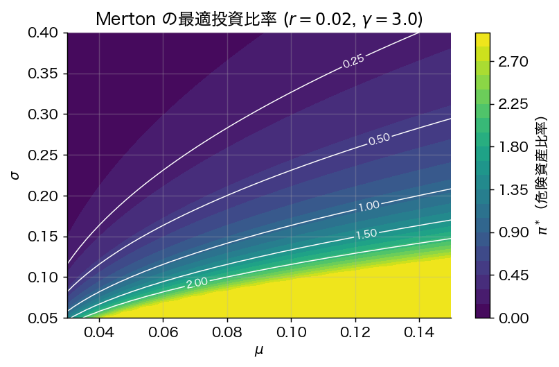
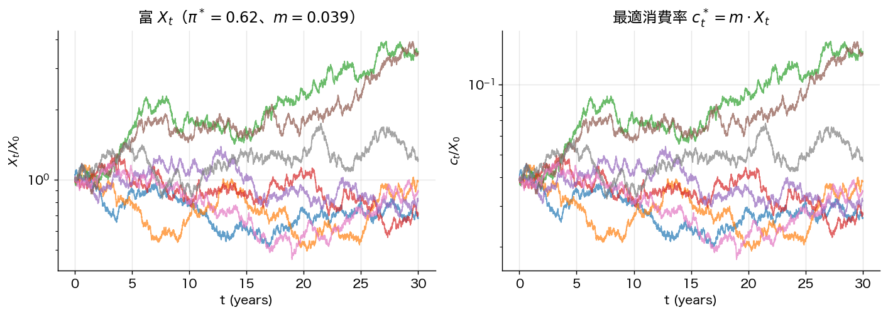

# 第10章 連続時間最適化：Merton 問題

> 🎯 **この章で答える問い**
> - 「**今この瞬間** 持っている富のうち、何 % をリスク資産に置くべきか」を時間連続で問うとどうなるか。
> - 答えはなぜ静的 Markowitz と同じ形（$\Sigma^{-1}(\mu - r\mathbf{1})$）になるのか。
> - 「リスク回避度 $\gamma$ が大きいほど現金多め、消費は富比例」というお馴染みの結論はどこから来るか。
>
> 📐 **使う数学**：Taylor 展開、確率変数の平均と分散、ラグランジュ未定乗数法。
>
> ⚠️ **本章の方針**：本格的な **HJB 方程式** や **Itô 解析** は学部 4 年向けには重すぎるため、本書では **「1 期間離散モデルを連続時間極限する」近似的導入** だけを示す。完全な厳密版は章末の道標を参照。

Markowitz は単期的な静的問題を扱う。実際には投資家は **時間を通じて連続的に再配分** し、しかも **消費** も行う。Merton (1969, 1971) はこの問題を確率制御として定式化し、CRRA 効用下では閉形解を得た。本書では「1 期間モデルの極限」として Merton 解の主要な形（最適投資比率）を導く。

## 10.1 市場モデル

- 無リスク資産：1 期間で $1 + r \Delta t$ に成長。
- 危険資産：1 期間のリターン $\Delta S / S = \mu \Delta t + \sigma \sqrt{\Delta t}\, \varepsilon$、$\mathbb{E}[\varepsilon] = 0$, $\mathbb{E}[\varepsilon^2] = 1$。

$\Delta t \to 0$ の極限が **幾何ブラウン運動**：
$$
\frac{dS_t}{S_t} = \mu\, dt + \sigma\, dW_t.
$$
$W_t$ は **標準ブラウン運動**（連続だが微分不能、平均 0・分散 $t$ の連続時間ガウス過程）。

> 📐 **数学補足 box：ブラウン運動と幾何ブラウン運動**
>
> ブラウン運動 $W_t$ は次の 3 性質で特徴づけられる：
> 1. $W_0 = 0$
> 2. 増分 $W_{t+s} - W_t \sim \mathcal{N}(0, s)$（分散が時間幅に比例）
> 3. 異なる時間帯の増分は独立
>
> 幾何ブラウン運動 $dS = \mu S\, dt + \sigma S\, dW$ は「対数リターン $\log S_t$ がブラウン運動 + ドリフト」となる過程。株価モデルとして最も基本的。

## 10.2 1 期間ポートフォリオ問題 → 連続時間極限

時刻 $t$ で富 $X_t$ のうち比率 $\pi$ を危険資産、$(1-\pi)$ を無リスク資産に置く。短時間 $\Delta t$ の富の変化は

$$
\frac{\Delta X}{X} = \pi \cdot (\mu \Delta t + \sigma \sqrt{\Delta t}\, \varepsilon) + (1 - \pi) \cdot r \Delta t = [r + \pi(\mu - r)] \Delta t + \pi \sigma \sqrt{\Delta t}\, \varepsilon.
$$

CRRA 効用 $u(W) = W^{1-\gamma}/(1-\gamma)$ を Taylor 展開：
$$
\mathbb{E}[u(X + \Delta X)] \approx u(X) + u'(X) X \cdot \mathbb{E}\!\left[\frac{\Delta X}{X}\right] + \tfrac{1}{2} u''(X) X^2 \cdot \mathbb{E}\!\left[\left(\frac{\Delta X}{X}\right)^2\right].
$$

ここで
$$
\mathbb{E}\!\left[\frac{\Delta X}{X}\right] = [r + \pi(\mu - r)] \Delta t, \qquad \mathbb{E}\!\left[\left(\frac{\Delta X}{X}\right)^2\right] = \pi^2 \sigma^2 \Delta t + o(\Delta t).
$$

$\Delta t$ の 1 次まで残し、$u'(X) = X^{-\gamma}$, $u''(X) = -\gamma X^{-\gamma - 1}$ を代入して **$\pi$ について最大化** すべき主要項は
$$
\pi (\mu - r) - \frac{\gamma}{2} \pi^2 \sigma^2.
$$

一階条件 $\mu - r - \gamma \pi \sigma^2 = 0$ より
$$
\boxed{\;\pi^\star = \frac{\mu - r}{\gamma \sigma^2}\;}
$$

これが **Merton 最適投資比率** の主要部分。$\Delta t \to 0$ の極限で連続時間問題の解と一致する。

> ⚠️ **実務注意 box：これは「投資比率の近似的導入」であって厳密な Merton 解の導出ではない**
>
> 上の議論は「投資比率」のみを扱っている。消費を同時に最適化する完全な Merton 問題では、消費 $c$ も同オーダーで効くため、価値関数の時間微分 $V_t$、消費効用 $u(c)$、富減少項 $-c \cdot V_X$ を全部同時に含む **HJB 方程式** を解かねばならない。本節の式は「投資政策の形」を予感させる入門であり、厳密性は章末の道標に従う。

## 10.3 結論の解釈

最適投資比率 $\pi^\star = (\mu - r)/(\gamma \sigma^2)$ について：

- **超過リターン $\mu - r$ が大きいほど投資を増やす**（当然）。
- **ボラティリティ $\sigma$ の 2 乗で割る** ため、ボラが 2 倍になると投資は 1/4。
- **リスク回避度 $\gamma$ が大きいほど投資を減らす**。$\gamma = 1$（対数効用）で「Kelly 基準」に一致。
- **時間不変**：$\pi^\star$ は時刻にも富水準にも依存しない（CRRA 効用の同次性）。

多資産化：$\mu \in \mathbb{R}^n$, $\Sigma$ で
$$
\pi^\star = \frac{1}{\gamma}\, \Sigma^{-1}(\mu - r \mathbf{1}).
$$
**第2章の接線ポートフォリオの方向と完全に一致**。これが「Markowitz の静的解が動的にもそのまま使える」という驚くべき事実である。

## 10.4 最適消費（結論のみ）

完全な Merton 問題では「投資 + **消費**」を同時最適化する。本書では結果だけを述べる：

**事実 10.1**（Merton 1969, 結論のみ）
CRRA 効用 $u(c) = c^{1-\gamma}/(1-\gamma)$, 主観割引率 $\rho$ の無限期間問題で、最適消費率は富に比例：
$$
c^\star_t = m \cdot X_t, \qquad m = \frac{1}{\gamma}\left[\rho - (1 - \gamma)\left(r + \frac{(\mu - r)^2}{2 \gamma \sigma^2}\right)\right].
$$

直観：「**今期の消費** vs **投資して将来消費**」のトレードオフを取り、富比例で消費する政策が最適。富が増えれば消費も比例して増える（CRRA の同次性の帰結）。

## 10.5 拡張トピック（概観のみ）

実際の Merton 問題には多くの拡張がある。本書では結論だけ：

- **状態変数依存の市場（時変 $\mu, \sigma$）**：「**ヘッジ需要**」項が現れ、Merton (1973) の **異時点間 CAPM (ICAPM)** につながる。
- **取引費用**：「**無取引帯**」を持つ最適政策（Davis–Norman 1990）。
- **借入制約・空売り禁止**：自由境界問題に帰着。
- **ジャンプ過程**：Merton (1976) のジャンプ拡散モデル。

## 10.6 まとめ

- 連続時間 Merton 問題の最適投資比率は **静的 Markowitz の接線方向と同じ**。
- リスク回避度 $\gamma$ が高いほど現金多め、ボラティリティ 2 乗で投資を絞る。
- 最適消費は富比例（CRRA 効用の帰結）。
- 厳密な HJB 方程式・Itô 解析・確率制御は大学院修士課程の専門科目（[上級学習への道標] 参照）。

> 🛣 **上級学習への道標**
> - **HJB 方程式と動的計画原理**：Karatzas & Shreve *Brownian Motion and Stochastic Calculus* (1991)、Pham *Continuous-time Stochastic Control and Optimization with Financial Applications* (2009)。
> - **マーチンゲール法（Cox–Huang 1989, Karatzas–Lehoczky–Shreve 1987）**：動的予算制約を **静的予算制約** に書き換える別解法。完全市場・凸双対の枠組み。
> - **リスク中立測度との関係**：本章は実際の確率測度の下での投資問題。デリバティブ価格付けは「リスク中立」と呼ばれる別の確率測度を用いる（Black–Scholes–Merton 1973）。両者の関係は **確率割引因子 (SDF)** を介して理解できる（Cochrane *Asset Pricing*, 2005）。
> - 本書で省略した **消費を含む完全な導出** はラグランジュ + Bellman 方程式で行う。学部生にとっては Stokey & Lucas *Recursive Methods in Economic Dynamics* (1989) の離散版から入ると bridge しやすい。

---
[← 第9章](09_black_litterman.md) ｜ [次章 → 第11章 パフォーマンス評価](11_performance_evaluation.md)
