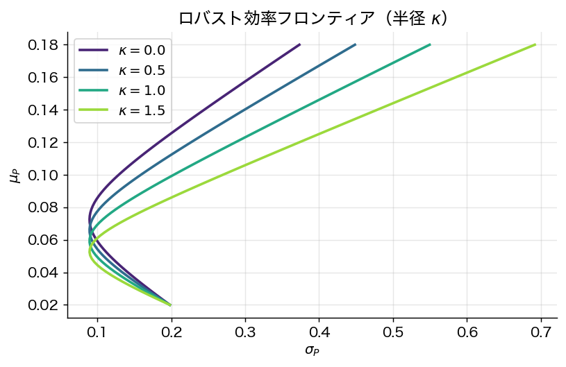

# 第13章 ロバスト/分布ロバスト・ポートフォリオ最適化

> 🎯 **この章で答える問い**
> - 「期待リターン $\mu$ が **本当には** いくらか分からない」状態でどう最適化するか。
> - **min–max（最悪ケース）** 最適化のアイデアと、それが Markowitz 解とどう違うか。
> - 「ロバストにする = 分散する」ではない、という驚くべき事実。
>
> 📐 **使う数学**：ラグランジュ法、Cauchy–Schwarz 不等式。
>
> ⚠️ **本章の方針**：SOCP/SDP の **凸最適化の詳細** や **Wasserstein 距離** は学部 4 年向けには重い。本書では「不確実性集合の半径 $\kappa$ を変えるとフロンティアがどう動くか」という直観中心で解説する。

Markowitz 解は $\mu, \Sigma$ の推定誤差に対して **極端に高感度** であった（第1章 1.7 節）。本章では「パラメタが不確実性集合に属することのみ仮定」して **最悪ケース最適化** を行うフレームワークを展開する。

## 13.1 楕円体不確実性集合（Goldfarb–Iyengar 2003）

**問題**：期待リターンが点推定 $\hat\mu$ の周りの楕円体に属し
$$
\mathcal{U}_\mu = \{ \mu : (\mu - \hat\mu)^\top \Theta^{-1} (\mu - \hat\mu) \le \kappa^2 \}.
$$
共分散 $\Sigma$ も因子構造 $\Sigma = B \Omega B^\top + D$ に基づく不確実性集合 $\mathcal{U}_\Sigma$ に属するとする。

**目標**：分散制約下で最悪ケース期待リターンを最大化
$$
\max_w\ \min_{\mu \in \mathcal{U}_\mu}\ w^\top \mu \quad \text{s.t.}\quad \max_{\Sigma \in \mathcal{U}_\Sigma} w^\top \Sigma w \le \sigma_0^2,\ \mathbf{1}^\top w = 1.
$$

**定理 13.1**（Goldfarb–Iyengar 2003, *Math. Oper. Res.* 28: 1–38）
上記問題は **二次錐計画（SOCP）** に等価変換され、効率的に解ける：
$$
\max_w\ w^\top \hat\mu - \kappa \|\Theta^{1/2} w\|_2,\quad \text{s.t.}\ \cdots
$$

*証明方針*：
- 内側 min は楕円体内の双対化により $\min_\mu w^\top \mu = w^\top \hat\mu - \kappa \sqrt{w^\top \Theta w}$（Cauchy–Schwarz）。
- 共分散の不確実性は半正定値性を保ったまま LMI 制約に書き直せる。
- 全体として SOCP / SDP に帰着。$\square$

**実装ヒント**：CVXPY などのコーン最適化ソルバで実装可能。$\kappa$ は **信頼度パラメタ**（$\kappa = \chi^2_p(1-\delta)^{1/2}$ で $1-\delta$ 信頼集合に対応）。

## 13.2 査読者の警告：robust ≠ 分散

「Goldfarb–Iyengar が SOCP に落ちる」ことと「結果がよいポートフォリオ」であることは別。**不確実性集合の半径・形状** に結果が極端に依存する：

- $\kappa$ を大きく取りすぎると過度に保守的、低リターン資産・少数資産への偏り。
- $\kappa$ を小さく取ると古典 Markowitz と差が出ない。
- separable な楕円体は非分散的になりやすい（Lu 2011, *Math. Programming* 126: 193–201）。

教育上の重要メッセージ：**robust 最適化 = 分散投資ではない**。

## 13.3 Garlappi–Uppal–Wang のアプローチ（2007）

**Garlappi–Uppal–Wang 2007**（*RFS* 20: 41–81）は Bayesian/multi-prior 枠組みで **閉形式** の robust 解を導く。

**設定**：投資家は $\mu$ について事前 $\mu \sim \mathcal{N}(\hat\mu, \Sigma/\tau)$（推定誤差を反映）を持ち、各 prior 集合上で **max–min 期待効用**
$$
\max_w \min_{\mu \in \mathcal{P}_\delta(\hat\mu)} \mathbb{E}[U(W)]
$$
を解く。$\mathcal{P}_\delta$ は likelihood ratio 制約による「曖昧性集合」。

**主結果**：最適解は **古典 Markowitz 解の縮小**：
$$
w_{\rm GUW}^\star = \frac{1}{\gamma + \epsilon(\delta, \tau)}\, \Sigma^{-1}(\hat\mu - r_f \mathbf{1})
$$
（$\epsilon$ は曖昧性度・標本誤差から決まる罰金項）。すなわち **曖昧性回避** は古典解を「無リスク資産方向」または「最小分散ポートフォリオ方向」へシフトさせる。

**驚くべき含意**：
- 曖昧性集合の置き方によっては **市場不参加（non-participation）** が最適となる。
- これは「分散投資が必ず良い」という Markowitz の直観と相容れない。
- 実証的にエクイティ・プレミアム・パズルや home bias の説明候補となる。

## 13.4 分布ロバスト最適化（DRO、概観のみ）

近年の発展は **分布ロバスト最適化（Distributionally Robust Optimization; DRO）**。これは「真の分布 $P$ が未知だが、経験分布 $\hat P_T$ の **近所** にあると仮定」する枠組みで、最悪ケース期待損失を最小化する：
$$
\min_w \sup_{P \in \mathcal{P}_\rho(\hat P_T)} \mathbb{E}_P[L(w, R)].
$$

不確実性集合 $\mathcal{P}_\rho$ の作り方で大きく 2 種類：

1. **モーメント DRO**（Delage–Ye 2010）：平均・共分散だけ信頼区間で抑える。
2. **Wasserstein DRO**（Mohajerin Esfahani–Kuhn 2018）：経験分布から確率質量を「動かすコスト」が $\rho$ 以下の分布族。

**重要な結果（驚き）**：Wasserstein DRO は **「経験平均 + 正則化項」** の形に書き直せ、これが **L2 正則化や Lasso と等価** になる場合がある。すなわち **ロバスト最適化と機械学習の正則化は同じコインの両面** という驚くべき洞察を生んだ。

学部レベルでは「DRO は『分布が分からない状況で最悪ケース最適化する技術』であり、機械学習の正則化と深い関係がある」と理解しておけば十分。詳細な数式は章末の道標を参照。

## 13.5 数値例：Robust frontier

楕円体不確実性 $\kappa = 0.5, 1.0, 1.5$ のフロンティアを描くと、$\kappa$ が大きいほどフロンティアが下方シフト（より保守的）。古典 Markowitz フロンティアは $\kappa = 0$ に対応。

## 13.6 まとめ

- ロバスト最適化は推定誤差を **明示的に** モデル化。
- Goldfarb–Iyengar の楕円体 SOCP はクリーンだが、集合設計次第で非分散になりうる。
- Garlappi–Uppal–Wang の閉形式は古典解の縮小として解釈でき、曖昧性回避が **市場不参加** すら導きうる。
- Delage–Ye と Wasserstein DRO は機械学習との橋渡し。
- 「robust = 分散 = 安定」は誤った直観：パラメタ設計が結果を支配する。

> 🛣 **上級学習への道標**
> - **凸最適化と SOCP/SDP**：Boyd & Vandenberghe *Convex Optimization* (2004)、Ben-Tal–El Ghaoui–Nemirovski *Robust Optimization* (2009)。
> - **Wasserstein DRO の数式**：Mohajerin Esfahani & Kuhn (2018) は経験分布の確率質量を「動かすコスト」を Wasserstein 距離（最適輸送理論の距離）で測る。これが正則化機械学習と等価になる議論は Blanchet–Murthy (2019), Sinha–Namkoong–Duchi (2018) を参照。
> - **CVaR と DRO の関係**：CVaR は実は「ある特定の Wasserstein 不確実性集合上の DRO」として再解釈できる。

---
[← 第12章](12_shrinkage_rmt.md) ｜ [次章 → 第14章 リスクパリティと HRP](14_risk_parity_hrp.md)
