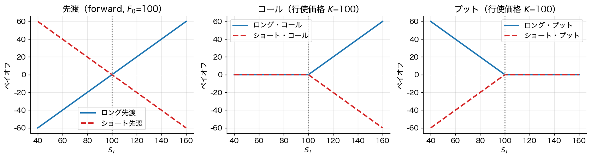
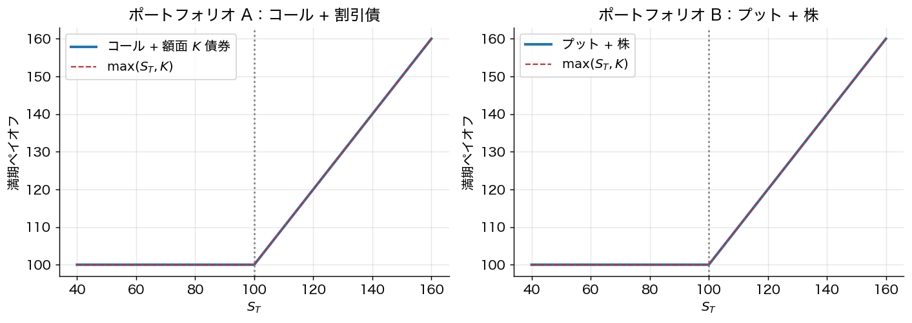
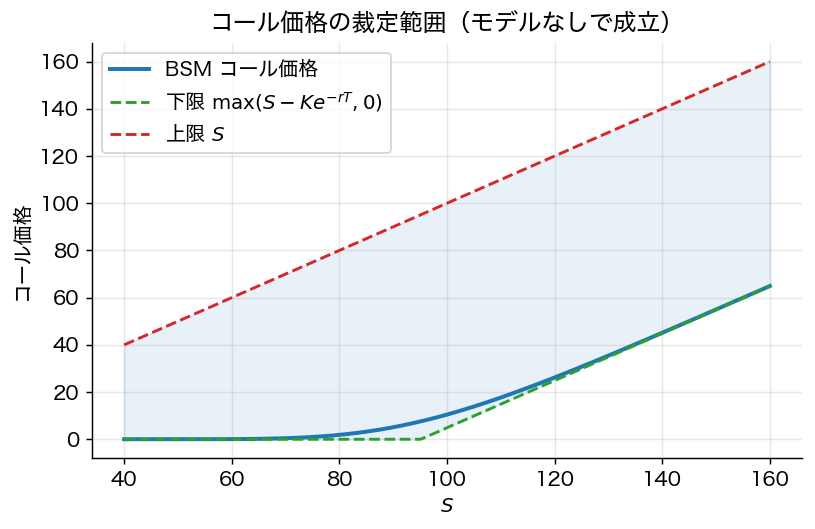

# 第17章 デリバティブ入門：無裁定とパリティ関係

> 🎯 **この章で答える問い**
> - **デリバティブ（派生証券）** とは何か。なぜ「将来の売買価格を今日決める」契約に意味があるのか。
> - フォワード価格 $F_0 = S_0 e^{rT}$ はどこから来るのか — **無裁定原理** だけから出る。
> - **コール・プット・パリティ** とは何で、なぜ違反したら裁定機会となるのか。
>
> 📐 **使う数学**：指数関数、現在価値割引、簡単な代数（連立方程式）。
>
> 🔑 **主要結果**：派生証券の価格は「期待値の予想」ではなく、**無裁定（一物一価）** によって決まる。

これまでの章は **株式・債券などの原資産** を直接保有するポートフォリオを扱ってきた。本章からは **デリバティブ（派生証券、derivatives）** — 原資産から派生して価値を持つ契約 — を扱う。代表例：

- **フォワード／先物（forward/futures）**：将来時点 $T$ に資産を一定価格 $K$ で売買する契約。
- **コール・オプション**：満期 $T$ に価格 $K$ で **買う権利**（義務ではない）を持つ契約。
- **プット・オプション**：満期 $T$ に価格 $K$ で **売る権利**（義務ではない）を持つ契約。
- **スワップ・CDS** などより複雑な契約は本章末の道標で名前だけ示す。

> 📜 **歴史 note：デリバティブは現代の発明か**
>
> デリバティブの歴史は古く、紀元前のメソポタミアの穀物先渡契約まで遡る。17 世紀オランダのチューリップ熱もオプション取引が一因とされる。シカゴ商品取引所 (1848) で先物取引が制度化され、シカゴ・オプション取引所 (1973) でオプション市場が現代化された。Black–Scholes–Merton (1973) の **価格付け公式** は、ちょうど同年の CBOE オープンと同時に発表され、市場の急成長を後押しした。

## 17.1 一物一価と無裁定原理

**無裁定原理 (no-arbitrage principle)**：
> リスクのないポジションでお金が増える機会はない。等価キャッシュフローを生む 2 つのポートフォリオは、現時点で **同じ価格** を持たねばならない。

これだけが本章のすべての公式の出発点である。**期待値も投資家の選好も使わない**。

> 🎯 **直観 box：無裁定はなぜ強力か**
>
> 「もしフォワード価格 $F$ が $S_0 e^{rT}$ より高すぎれば、（i）株を借りて空売り、（ii）受け取った $S_0$ を $r$ で運用、（iii）フォワードで $F$ を払い株を買い戻し空売りを閉じる」で **無リスクの利益 $F - S_0 e^{rT}$** が出る。市場参加者がこの裁定を取り尽くせば、価格は $S_0 e^{rT}$ に収束する。需要供給ではなく、**裁定の存在** が価格を決めるという考え方は派生証券論の核心。

## 17.2 フォワード価格

**設定**：時刻 0 で「時刻 $T$ に資産を $K$ で買う」フォワード契約に入る。配当のない資産、無リスク金利 $r$（連続複利）を仮定。

**フォワード価格** $F_0$ とは、「契約価値が 0 になる行使価格 $K$」のこと：
$$
\boxed{\;F_0 = S_0 e^{rT}\;}
$$

**導出（無裁定論証）**：
- ポートフォリオ A：フォワード買い + 額面 $K$ の割引債 → 時刻 $T$ に $S_T$
- ポートフォリオ B：現物株 1 単位（時刻 0 で $S_0$ 払う） → 時刻 $T$ に $S_T$
- 両者は時刻 $T$ で同じキャッシュフロー → 時刻 0 で同じ価値
- フォワード価値 0 とすると、$K e^{-rT} = S_0$、すなわち $K = F_0 = S_0 e^{rT}$

**配当のある場合**：連続配当利回り $q$ なら $F_0 = S_0 e^{(r-q)T}$。離散配当 $D$（現在価値）なら $F_0 = (S_0 - D) e^{rT}$。

## 17.3 オプションのペイオフ

満期 $T$ におけるペイオフ：

| 商品 | ロング・ペイオフ | ショート・ペイオフ |
|---|---|---|
| フォワード | $S_T - K$ | $K - S_T$ |
| コール | $(S_T - K)^+ = \max(S_T - K, 0)$ | $-\max(S_T - K, 0)$ |
| プット | $(K - S_T)^+ = \max(K - S_T, 0)$ | $-\max(K - S_T, 0)$ |

「コール = 上昇に賭ける、損失限定」、「プット = 下落保険」と粗く読める。が、これは「初心者向け説明」であって完全ではない（次節）。

> ⚠️ **実務注意 box：「コールはレバレッジ／プットは保険」の落とし穴**
>
> - **コールはレバレッジ**：株価が上昇しても、時間価値の減少 (theta) や IV 低下でコール価値が下がりうる。
> - **プットは保険**：プレミアム（保険料）が高すぎれば期待リターンを大きく削る。満期後の下落は守れない。
> - 一般に「**安価な保護**」は存在しない。市場でプットが安いときは、それを安く売ってよい理由が市場で広く認識されている時。

## 17.4 プット・コール・パリティ

**命題 17.1**（プット・コール・パリティ）
ヨーロピアン（満期にしか行使できない）コール $C$ とプット $P$（同じ $K, T$）について、配当なし資産では
$$
\boxed{\; C_0 - P_0 = S_0 - K e^{-rT} \;}
$$

**導出**：
- ポートフォリオ A：コール買い + 額面 $K$ の割引債（現在価値 $K e^{-rT}$）
  - 満期：$\max(S_T - K, 0) + K = \max(S_T, K)$
- ポートフォリオ B：プット買い + 現物株 1 単位
  - 満期：$\max(K - S_T, 0) + S_T = \max(S_T, K)$
- 両者のペイオフは恒等的に等しい → 現時点の価値も等しい
- $C_0 + K e^{-rT} = P_0 + S_0$

このパリティ違反が観測されたら、瞬時に裁定機会となる。実務上、最も基本的かつ厳密に守られる制約である。

> 📐 **数学補足 box：複製ポートフォリオ**
>
> パリティの導出は **「同じキャッシュフローを生む 2 つの方法は同じコスト」** という考え方だった。これは「複製ポートフォリオ」というデリバティブ評価の中心概念。第18章二項モデル、第19章 BSM でも同じ論法を繰り返し使う。

## 17.5 オプション価格の裁定範囲

無裁定だけから、オプション価格には **必ず満たすべき不等式** が出る：

| 範囲 | コール | プット |
|---|---|---|
| **下限** | $\max(S_0 - K e^{-rT}, 0) \le C_0$ | $\max(K e^{-rT} - S_0, 0) \le P_0$ |
| **上限** | $C_0 \le S_0$ | $P_0 \le K e^{-rT}$ |

これらは BSM のような特定モデルを使わずに導かれる。直観：
- コール価格 ≤ 株価（株よりお得ではない）
- コール価格 ≥ 「即時行使した場合の現在価値」

## 17.6 まとめ

- デリバティブ価格は **無裁定 + 複製** だけで決まる（期待値も選好も不要）。
- フォワード価格 $F_0 = S_0 e^{rT}$ は連続複利で割引した現在価値で表される。
- プット・コール・パリティはオプション価格の最も基本的な制約。
- オプション価格には BSM などのモデルなしでも裁定範囲がある。

> 🛣 **上級学習への道標**
> - **複雑なデリバティブ**：エキゾチック・オプション（バリア、アジアン、ルックバック）、CDS、IR スワップ。Hull *Options, Futures and Other Derivatives* (11th ed., 2021) が標準教科書。
> - **金利モデル**：Vasicek (1977), Cox–Ingersoll–Ross (1985), Hull–White (1990)、Heath–Jarrow–Morton (1992)。
> - **クレジット・デリバティブ**：強度モデル、構造モデル（Merton 1974, Black–Cox 1976）。
> - **流動性・摩擦のあるデリバティブ価格**：Bid-Ask スプレッド、超複製コスト、Föllmer–Schweizer の最小リスク戦略。

---
[← 第16章](16_backtest_overfit.md) ｜ [次章 → 第18章 二項モデル](18_binomial_model.md)
