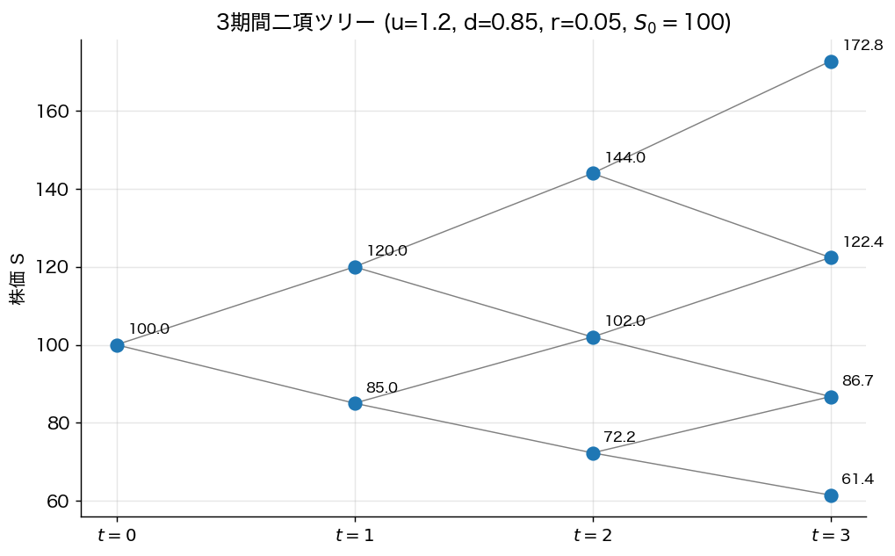
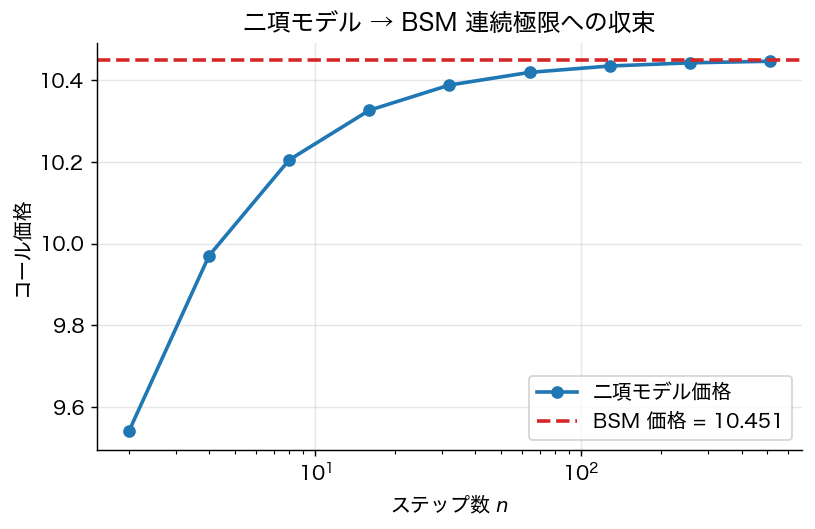

# 第18章 二項モデルとリスク中立確率

> 🎯 **この章で答える問い**
> - 上下にしか動かない超単純な株価モデルで、なぜオプション価格が **一意に決まる** のか。
> - **リスク中立確率** $q = (e^{r\Delta t} - d)/(u - d)$ は何を意味するのか — 実際の上昇確率ではない。
> - **複製ポートフォリオ** とは何で、それがなぜ「価格そのもの」になるのか。
>
> 📐 **使う数学**：連立 1 次方程式、二項分布、現在価値の割引。
>
> 🔑 **主要結果**：1 期間二項モデルでオプション価格は **$V_0 = e^{-r\Delta t}[q V_u + (1-q) V_d]$**。これは「リスク中立確率の下での割引期待値」と読める。

二項モデル (Cox–Ross–Rubinstein 1979) は、株価が「上に $u$ 倍」「下に $d$ 倍」だけ動く極端に単純なモデル。それでも **複製とリスク中立評価** の本質を全て見せる。BSM の連続時間モデルへの自然な橋渡しでもある。

## 18.1 一期間二項モデル

時刻 0 で株価 $S_0$、無リスク金利 $r$、時間幅 $\Delta t$。時刻 $\Delta t$ で株価は

- 上昇：$S_u = u S_0$（$u > 1$）
- 下降：$S_d = d S_0$（$d < 1$）

の 2 値のみ取る。ヨーロピアン・コール（行使価格 $K$）の満期ペイオフは

- $V_u = (u S_0 - K)^+$
- $V_d = (d S_0 - K)^+$

**問い**：現時点の価値 $V_0$ はいくらか？

## 18.2 複製ポートフォリオによる価格付け

**戦略**：株を $\Delta$ 単位、無リスク債券を額面 $B$ 単位持ったポートフォリオを作り、それが時刻 $\Delta t$ でコールと同じペイオフを生むようにする。連立式：

$$
\begin{cases}
\Delta \cdot u S_0 + B e^{r \Delta t} = V_u \\
\Delta \cdot d S_0 + B e^{r \Delta t} = V_d
\end{cases}
$$

これを解いて

$$
\Delta = \frac{V_u - V_d}{S_0 (u - d)}, \qquad B = e^{-r\Delta t} \cdot \frac{u V_d - d V_u}{u - d}.
$$

**結論**：複製ポートフォリオの現在価値が、コール価格である：
$$
V_0 = \Delta \cdot S_0 + B.
$$

> 🎯 **直観 box：なぜ複製ポートフォリオの価値が「価格」になるのか**
>
> もし $V_0$ がこれと異なれば、（i）安い方を買い、（ii）高い方を売れば、満期のペイオフが完全に相殺して **無リスクで利益** が出る。市場参加者がこの裁定を取り尽くせば、$V_0$ は複製コストに収束する。**期待値も、投資家のリスク回避度も、何の役にも立たない** — 複製コストだけが価格を決める。

## 18.3 リスク中立確率という書き直し

上の閉じた式を整理すると、驚くべき形に書ける：

$$
\boxed{\;V_0 = e^{-r\Delta t} [q V_u + (1 - q) V_d]\;}
$$

ここで
$$
q = \frac{e^{r \Delta t} - d}{u - d}.
$$

これは「**確率 $q$ で上昇、$1-q$ で下降する世界での **期待ペイオフ** を、無リスク金利で割引したもの**」。$q$ を **リスク中立確率（risk-neutral probability）** と呼ぶ。

> ⚠️ **実務注意 box：リスク中立確率 $q$ は実際の上昇確率ではない**
>
> 学部生が最もハマる落とし穴は、$q$ を「現実に株価が上がる確率」と読むこと。これは **完全な誤解**。$q$ は「**裁定なし価格を計算するための人工的な確率**」であって、現実の確率測度 $p$ とは別物。
>
> - $q$ の下では、株式の期待リターンは無リスク金利 $r$（リスクプレミアム 0）。これは現実とは違う。
> - $p > 0.5$ でも $q < 0.5$ になりうる。
> - $q$ は「割引した株価がマルチンゲール」となる **唯一の確率測度**。
>
> 「現実確率 $p$ で投資判断、リスク中立確率 $q$ で価格計算」という **2 つの確率測度の使い分け** が、本章で最も重要なポイント。

## 18.4 無裁定条件と $q$ の存在

リスク中立確率 $q \in (0, 1)$ が存在するためには
$$
d < e^{r \Delta t} < u
$$
が必要。これに違反すると裁定機会が生まれる：

- $u \le e^{r \Delta t}$：株を空売り、無リスクで運用 → 必ず勝つ。
- $e^{r \Delta t} \le d$：株を借入で買う → 必ず勝つ。

この条件は **無裁定 ⟺ リスク中立確率の存在** という資産価格論の基本定理 (Fundamental Theorem of Asset Pricing, FTAP) の最小版である。

## 18.5 多期間二項モデル

満期 $T$ を $n$ ステップに分け、$\Delta t = T/n$ とする。各期で独立に上下するなら、$n$ 期後の株価分布は二項分布：
$$
S_T = S_0 u^J d^{n-J}, \qquad J \sim \mathrm{Binomial}(n, q)
$$
（リスク中立測度の下で）。コール価格は
$$
V_0 = e^{-rT} \sum_{j=0}^n \binom{n}{j} q^j (1-q)^{n-j} \cdot \max(S_0 u^j d^{n-j} - K, 0).
$$

**Cox–Ross–Rubinstein のキャリブレーション**：BSM と整合する $u, d$ の設定：
$$
u = e^{\sigma \sqrt{\Delta t}}, \qquad d = e^{-\sigma \sqrt{\Delta t}}, \qquad q = \frac{e^{r \Delta t} - d}{u - d}.
$$

## 18.6 アメリカン・オプションの扱い

二項モデルの実務的価値は、**満期前にいつでも行使できるアメリカン・オプション** を扱えること（BSM 公式では難しい）。各ノードで
$$
V_{\rm node} = \max\bigl(\,\text{即時行使ペイオフ},\ e^{-r\Delta t}[q V_u + (1-q) V_d]\,\bigr)
$$
として後ろ向き帰納で解く。

> 📐 **数学補足 box：後ろ向き帰納（Backward Induction）**
>
> 動的計画法 (Bellman) の特殊形。「最後の状態から始めて、各時点でその時点での最適決定を計算しながら時間を遡る」方法。第10章 Merton 問題の HJB 方程式も同じ原理の連続時間版。

## 18.7 BSM への極限（連続時間化のスケッチ）

ステップ数 $n \to \infty$、$\Delta t = T/n \to 0$ の極限で何が起こるかを見る。

1. CRR キャリブレーションで $u = e^{\sigma \sqrt{\Delta t}}, d = e^{-\sigma \sqrt{\Delta t}}$
2. $n$ 期後の対数株価：$\log S_T = \log S_0 + (2J - n)\sigma\sqrt{\Delta t}$
3. $J \sim \mathrm{Binomial}(n, q)$ より、中心極限定理で正規分布へ収束
4. $q$ を $\Delta t$ で展開し、平均・分散を計算すると：
$$
\log S_T \sim \mathcal{N}\!\left(\log S_0 + (r - \tfrac{1}{2} \sigma^2) T,\ \sigma^2 T\right)
$$
（リスク中立測度の下で）
5. これは **幾何ブラウン運動** $dS = r S\, dt + \sigma S\, dW$ の解と同じ分布

すなわち二項モデルの連続極限が **BSM のリスク中立 GBM** に一致する。BSM コール価格は
$$
C_0 = e^{-rT} \mathbb{E}^Q\!\bigl[(S_T - K)^+\bigr]
$$
の積分計算から導かれる（第19章）。

## 18.8 まとめ

- 二項モデルは「複製とリスク中立評価」の最小モデル。
- $V_0 = e^{-r\Delta t}[q V_u + (1-q) V_d]$ は **裁定なし価格** の表現。
- リスク中立確率 $q$ は計算用の人工確率であって現実の上昇確率ではない。
- 多期間化と CRR キャリブレーションで BSM 連続時間モデルへ収束。
- アメリカン・オプションを扱える点で実務的に重要。

> 🛣 **上級学習への道標**
> - **資産価格論の基本定理 (Fundamental Theorem of Asset Pricing)**：無裁定 ⟺ 等価マルチンゲール測度の存在。Harrison–Pliska (1981), Delbaen–Schachermayer (1994) が標準的厳密版。
> - **不完備市場での価格付け**：完全に複製できないオプション（ジャンプ・確率ボラ・取引費用）には複数のリスク中立測度が存在。**最小エントロピー測度** (Frittelli 2000)、**変動最小ヘッジ** (Föllmer–Schweizer 1991) などの選択基準が研究されている。
> - **モンテカルロ法による多期間価格付け**：Longstaff–Schwartz (2001) の最小二乗法でアメリカン・オプションを評価。

---
[← 第17章](17_derivatives_intro.md) ｜ [次章 → 第19章 BSM と Greeks](19_black_scholes.md)
