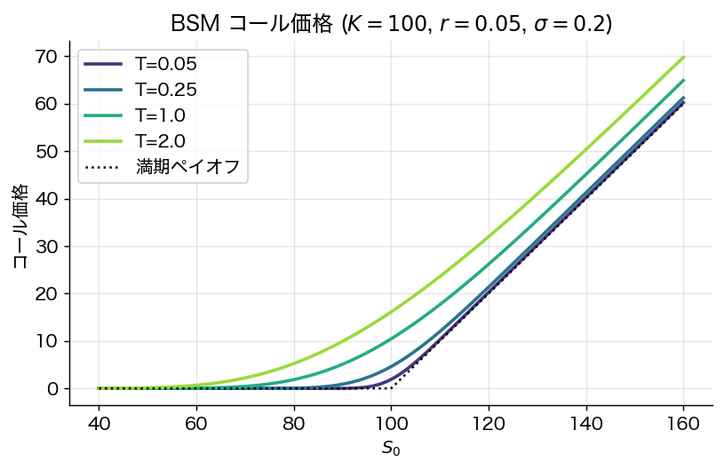
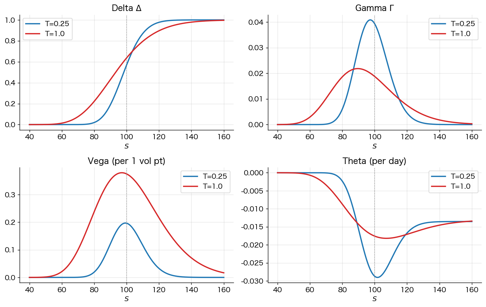
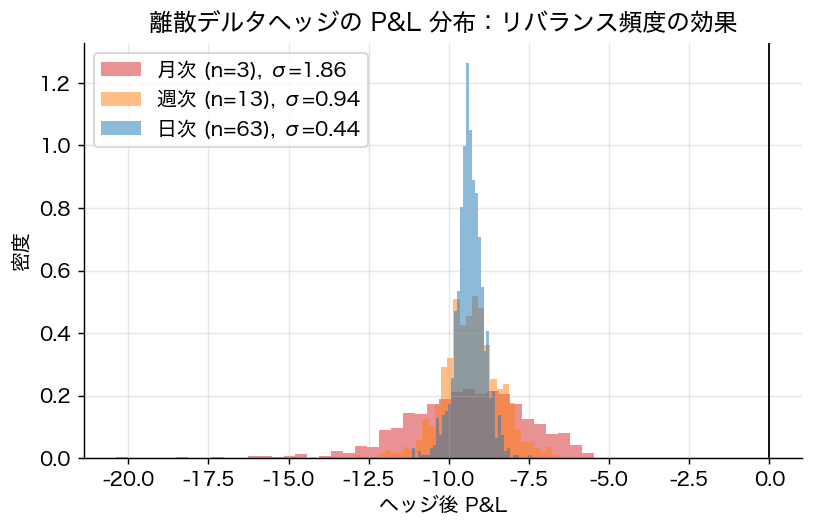
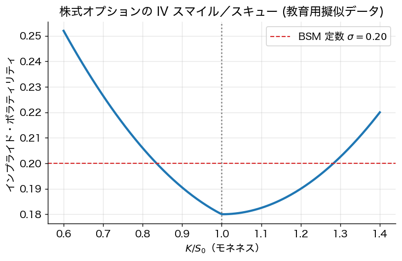

# 第19章 Black–Scholes–Merton と Greeks

> 🎯 **この章で答える問い**
> - **Black–Scholes–Merton (BSM) 公式** $C = S_0 N(d_1) - K e^{-rT} N(d_2)$ は何を意味するのか。
> - **Greeks**（$\Delta, \Gamma, \mathrm{Vega}, \Theta, \rho$）とは何で、なぜ実務で重要か。
> - **インプライド・ボラティリティ (IV)** とは何で、なぜ「スマイル」になるのか。
> - 連続デルタヘッジは本当に「無リスク」か？ — 離散リバランスのシミュレーションで検証する。
>
> 📐 **使う数学**：正規分布の累積分布関数 $N(\cdot)$、対数正規分布、簡単な偏微分。
>
> ⚠️ **本章の方針**：BSM の **厳密な PDE 導出**（Itô の補題 + 無裁定）は第18章の二項モデル連続極限で代用する。本章では **公式の使い方と直観** を重視。

## 19.1 BSM 公式

**設定**：原資産の価格が幾何ブラウン運動 $dS = \mu S\, dt + \sigma S\, dW$（実確率）に従う。無リスク金利 $r$、ボラティリティ $\sigma$ 一定、配当なし、連続取引、無摩擦。

**定理 19.1**（Black–Scholes–Merton 1973）
ヨーロピアン・コール（行使価格 $K$、満期 $T$）の現在価格は
$$
\boxed{\;
C_0 = S_0 N(d_1) - K e^{-rT} N(d_2)
\;}
$$
ここで
$$
d_1 = \frac{\log(S_0 / K) + (r + \sigma^2 / 2) T}{\sigma \sqrt{T}}, \qquad d_2 = d_1 - \sigma \sqrt{T},
$$
$N(\cdot)$ は標準正規分布の累積分布関数。

プットは **パリティ** から
$$
P_0 = K e^{-rT} N(-d_2) - S_0 N(-d_1).
$$

**導出スケッチ**（第18章 §18.7 から）：
- 二項モデルの連続極限でリスク中立 GBM $dS = r S\, dt + \sigma S\, dW$
- リスク中立期待値 $C_0 = e^{-rT} \mathbb{E}^Q[(S_T - K)^+]$
- $\log S_T$ が正規分布 $\mathcal{N}(\log S_0 + (r - \sigma^2/2)T, \sigma^2 T)$ なので、対数正規分布の上での積分を計算
- 結果が上式

> 📐 **数学補足 box：$N(d_1)$ と $N(d_2)$ の意味**
>
> - $N(d_2)$：「リスク中立確率の下で **コールが行使される確率**」$Q(S_T > K)$
> - $N(d_1)$：「リスク中立確率の下で、行使条件下の **株価の現在価値による加重確率**」
> - したがって BSM 公式は「**行使時の株を受け取る** $-$ **行使価格を払う**」の期待値割引版という構造を持つ
>
> ⚠️ **よくある誤解**：$N(d_2)$ は **リスク中立確率**。現実確率で行使される確率とは違う。

> 🎯 **直観 box：BSM 価格は「期待値の予想」ではない**
>
> BSM 価格 $C_0$ は「将来の株価を予想して期待値を取った価格」ではない。**「連続的にデルタヘッジするなら、満期ペイオフを複製するのにいくらかかるか」** という **複製コスト** を表す式である。これが入門で最もハマる点：**実確率の $\mu$（株式の真の期待リターン）は BSM 公式に登場しない**。代わりに無リスク金利 $r$ だけが出る。

## 19.2 Greeks（リスク感応度）

BSM 価格を諸パラメタで偏微分したものが **Greeks**。実務でオプション・ポートフォリオのリスクを管理する核心ツール。

### 19.2.1 Delta $\Delta$
$$
\Delta_C = \frac{\partial C}{\partial S} = N(d_1), \qquad \Delta_P = N(d_1) - 1.
$$

**意味**：株価が 1 円上がったときのオプション価格の上昇額。**ヘッジ比率** として最も基本。コール $\Delta \in [0, 1]$、プット $\Delta \in [-1, 0]$。

**ATM（at-the-money, $S \approx K$）** で $\Delta \approx 0.5$、**ITM（in-the-money）** で $1$ に近づき、**OTM（out-of-the-money）** で $0$ に近づく。

### 19.2.2 Gamma $\Gamma$
$$
\Gamma = \frac{\partial^2 C}{\partial S^2} = \frac{\phi(d_1)}{S_0 \sigma \sqrt{T}}
$$
（$\phi$ は標準正規 PDF）。**Delta が株価でどう変わるか**（曲率）。ATM・短満期で最大。

### 19.2.3 Vega $\nu$
$$
\nu = \frac{\partial C}{\partial \sigma} = S_0 \phi(d_1) \sqrt{T}.
$$
**ボラティリティ感応度**。ATM・長満期で最大。

### 19.2.4 Theta $\Theta$
$$
\Theta_C = -\frac{S_0 \phi(d_1) \sigma}{2 \sqrt{T}} - r K e^{-rT} N(d_2).
$$
**時間経過によるオプション価値の減少率**（通常負）。

### 19.2.5 Rho $\rho$
$$
\rho_C = K T e^{-rT} N(d_2).
$$
**金利感応度**。長満期コールほど大きい。

> ⚠️ **実務注意 box：Greeks の代表的な誤解**
>
> 1. **$\Delta$ を「行使される確率」と読む**：$\Delta = N(d_1)$ は厳密には行使確率（$N(d_2)$）と違う。
> 2. **$\Gamma$ を無視して $\Delta$ が一定だと思う**：株価が大きく動くと $\Delta$ も動く（曲率効果）。
> 3. **$\Theta$ は売り手に有利と単純化**：時間価値減少は売り手の儲けだが、その間ボラが上がると損する。
> 4. **Vega は満期直前に最大と思う**：実は **ATM・長満期** で最大。
> 5. **Vega の単位**：BSM 標準では「$\sigma$ が $1.00$ 増えた時の価格変化」（$0.20 \to 1.20$）。実務では「1 vol point ($0.20 \to 0.21$)」あたりに換算するため $/ 100$ することが多い。

## 19.3 デルタヘッジと P&L

オプションを売った市場メイカーは、自分のポジションを **デルタ中立** にすることでリスク軽減を図る。コールを 1 単位売ったら、株を $\Delta$ 単位買って保有する：
$$
\text{ポートフォリオ価値} = -C + \Delta \cdot S.
$$

理論的には連続的に $\Delta$ を再調整すれば **完全ヘッジ**。実際は離散リバランスなので **ヘッジ誤差** が残る。

> 🎯 **直観 box：「BSM 価格 = 動的複製コスト」が腑に落ちる場面**
>
> オプションを売って $C_0$ を受け取り、デルタヘッジで株を売買し続ける。**もし $\sigma$ の予想が正しく、連続リバランスができれば、累積した株売買コストと借入金利の合計は最終的に $C_0$ にぴたり一致する**。すなわち $C_0$ は「複製コスト」そのもの。実際は離散ヘッジによる誤差が残るが、誤差の標準偏差は $\sqrt{\Delta t}$ で減る。

## 19.4 インプライド・ボラティリティ

市場で観測されたオプション価格 $C_{\rm mkt}$ について、BSM 公式を逆向きに解いて $\sigma$ を求めたものが **インプライド・ボラティリティ (Implied Volatility; IV)**：
$$
C_{\rm mkt} = C_{\rm BS}(S_0, K, r, T, \sigma_{\rm imp}).
$$

$\sigma_{\rm imp}$ は「市場が考えるボラティリティ」と解釈される。

### IV スマイル

BSM が現実なら、行使価格 $K$ にかかわらず IV は一定のはず。しかし実際は：
- **株式オプション**：低 $K$（OTM プット）で IV が高い → **スキュー**（右下がり）
- **為替・コモディティ**：両側で IV が高い → **スマイル**

理由：
1. **テールリスク**（クラッシュ）の警戒
2. ボラティリティ自体の不確実性（**確率ボラティリティ**）
3. 需給（プット保険の需要）

## 19.5 BSM の前提と実務的修正

BSM の前提と現実のズレ：

| 前提 | 現実 |
|---|---|
| GBM（連続価格） | ジャンプ（決算、ニュース） |
| 定数 $\sigma$ | 時変・ランダムボラ |
| 連続取引 | 離散リバランス、取引費用 |
| 無摩擦 | bid-ask、流動性プレミアム |
| 配当なし | 配当あり（個別株、指数） |

**実務的補正**：
- **配当**：$d_1, d_2$ で $r$ を $r - q$ に置換（連続配当利回り $q$）。
- **確率ボラティリティ**：Heston (1993) モデル。$\sigma$ 自身が確率過程に従う。
- **ジャンプ拡散**：Merton (1976)、Kou (2002)。クラッシュ確率を明示的にモデル化。

> 📐 **学部生向け段落：BSM はなぜまだ使われるのか**
>
> BSM の前提は現実と乖離している。それでも実務で第一線で使われ続けている理由は：
>
> 1. **共通言語**：オプション価格を「インプライド・ボラ」という統一指標で議論できる。
> 2. **Greeks の解釈**：価格そのものよりも「$\Delta$ ヘッジ比率」「$\Gamma$ 曲率」「Vega 感応度」が重要で、これらは BSM の枠組みで計算しやすい。
> 3. **校正されたモデル**：BSM 価格を真実とは思わない。IV を時間・$K$ ごとに変える「市場が校正したパラメタ」として扱う。
>
> つまり BSM は「絶対的な価格モデル」ではなく「**業界の共通座標系**」。

## 19.6 オプションとパフォーマンス評価（第11章との接続）

オプション戦略は **歪んだリターン分布** を生むため、Sharpe 比だけで評価すると危険：

**例**：毎月 OTM プットを売る（**ボラティリティ売り** 戦略）
- 11 か月：毎月 $+1\%$ 利益（プレミアム回収）
- 1 か月：暴落で $-25\%$
- 平均月次リターン：$(11 \times 1\% - 25\%)/12 = -1.17\%$
- だがクラッシュ前の 11 か月だけ見ると、$\sigma \approx 0$, Sharpe 比 $= \infty$ に見える

**教訓**：
- **Sortino 比**：下方リスクのみペナルティ。
- **Calmar 比**：最大ドローダウン考慮。
- **CVaR**：テール損失の平均（第8章）。
- **シナリオ分析**：「もし 5σ 下落が来たら」の試算。

ヘッジファンドや投資銀行のオプション戦略評価ではこれらの併用が必須。

## 19.7 まとめ

- BSM 公式は「**動的複製コスト**」を与え、実確率の $\mu$ には依存しない。
- Greeks ($\Delta, \Gamma, \mathrm{Vega}, \Theta, \rho$) はリスク管理の核心ツール。
- インプライド・ボラティリティは市場の共通言語、スマイル／スキューが BSM 前提のズレを示す。
- BSM の前提は現実で破られるが、**校正された IV と Greeks** で実務的に補正される。
- オプション戦略は歪んだ分布を生むため、Sharpe 比単独では評価不能。

> 🛣 **上級学習への道標**
> - **確率ボラティリティ・ジャンプ拡散モデル**：Heston (1993), SABR (Hagan et al. 2002), Bates (1996), Kou (2002)、Merton (1976)。
> - **局所ボラティリティ**：Dupire (1994), Derman–Kani (1994)。
> - **ボラティリティ・サーフェスの校正**：実務的には数値最適化問題。Gatheral *The Volatility Surface* (2006) が標準書。
> - **ラフ・ボラティリティ**：Gatheral–Jaisson–Rosenbaum (2018, *Quantitative Finance* 18) — ボラがブラウン運動より「ラフ」な経路を持つことの実証と理論。
> - **ニューラルネット・オプション価格**：Hutchinson–Lo–Poggio (1994) から始まり、近年は Deep Hedging (Buehler et al. 2019)、ニューラル PDE 解法など。

---
[← 第18章](18_binomial_model.md) ｜ [次章 → 第20章 演習問題](20_exercises.md)
