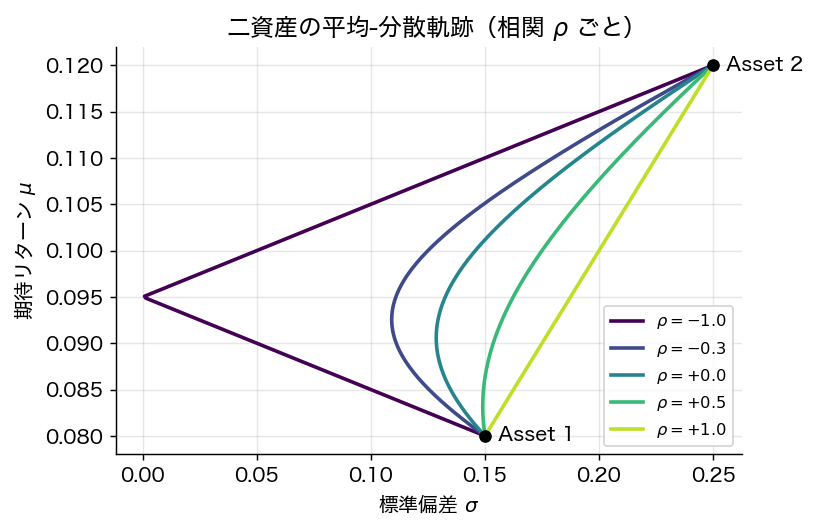
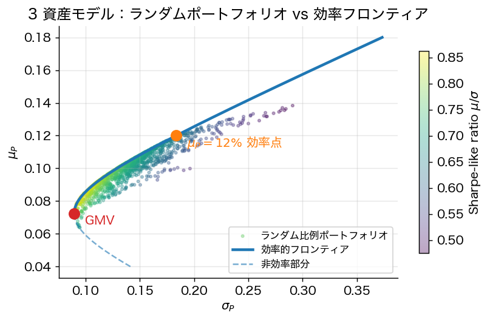
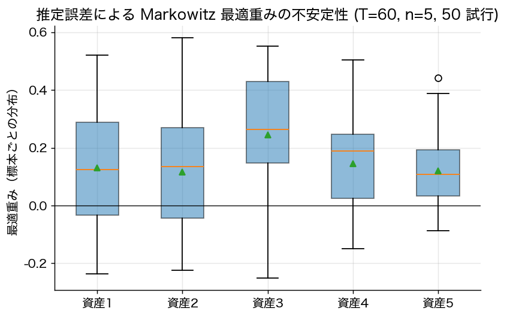

# 第1章 Markowitz の平均分散分析

> 🎯 **この章で答える問い**
> - 「投資のリスク」を **分散** で測ると何が決まるのか。
> - **分散投資** はなぜ機能するのか — 直観だけでなく数式で。
> - 最適ポートフォリオはどんな形で書けるか — 閉じた式で。
>
> 📐 **使う数学**：ラグランジュ未定乗数法、行列の逆行列、二次形式の最小化。
>
> 🔑 **主要結果**：効率的ポートフォリオは $w^\star = \alpha_1 \Sigma^{-1} \mathbf{1} + \alpha_2 \Sigma^{-1} \mu$ と書ける。すなわち **2 つの基底ベクトルだけ** で表現できる。

> *"Diversification is both observed and sensible; a rule of behavior which does not imply the superiority of diversification must be rejected both as a hypothesis and as a maxim."*  — H. M. Markowitz (1952)

## 1.1 問題設定

投資家が $n$ 個の危険資産に資金を配分する。リターン $R$ について $\mu = \mathbb{E}[R]$, $\Sigma = \mathrm{Cov}(R) \succ 0$ を所与とする。ポートフォリオ $w$ の

- 期待リターン：$\mathbb{E}[R_w] = w^\top \mu$
- 分散（リスク）：$\mathrm{Var}(R_w) = w^\top \Sigma w$

Markowitz の中心思想は次の二つ：

1. **「リスク」を分散で測る**。リターンの確率分布は平均と分散の二つの値だけで（投資家にとって）十分である。
2. **平均と分散のトレードオフを明示的に最適化する**。これにより「分散投資の価値」が定量化される。

## 1.2 平均分散効率性

**定義 1.1**（平均分散効率的ポートフォリオ）
ポートフォリオ $w^\star$ が **効率的（efficient）** であるとは、これと同じか高い期待リターンを持ち、かつ厳密に小さい分散を持つ別のポートフォリオが存在しないことをいう。すなわち以下の問題の解として特徴付けられる：

$$
\min_{w \in \mathbb{R}^n} \tfrac{1}{2} w^\top \Sigma w \quad \text{s.t.}\quad w^\top \mu = \mu_P,\ \mathbf{1}^\top w = 1. \tag{P}
$$

## 1.3 効率的ポートフォリオの陽な表現

問題 (P) は第0章の二次計画の枠組みに当てはまる。$A = \begin{pmatrix} \mu^\top \\ \mathbf{1}^\top \end{pmatrix}$, $b = \begin{pmatrix} \mu_P \\ 1 \end{pmatrix}$ とおき、次の **基本スカラー量** を定義する：

$$
A_0 := \mathbf{1}^\top \Sigma^{-1} \mathbf{1}, \qquad
B_0 := \mathbf{1}^\top \Sigma^{-1} \mu, \qquad
C_0 := \mu^\top \Sigma^{-1} \mu, \qquad
D_0 := A_0 C_0 - B_0^2.
$$

**補題 1.2**
$\mu$ が $\mathbf{1}$ と平行でない（つまり全資産の期待リターンが同一でない）とき $D_0 > 0$。

*証明方針*：$\Sigma^{-1} \succ 0$ より $(x, y) \mapsto x^\top \Sigma^{-1} y$ は内積、コーシー・シュワルツより $B_0^2 = (\mathbf{1}^\top \Sigma^{-1} \mu)^2 \le A_0 C_0$。等号は $\mu \parallel \mathbf{1}$ のときのみ。$\square$

**定理 1.3**（効率的ポートフォリオの陽な解）
問題 (P) の最適解は
$$
\boxed{\;
w^\star(\mu_P) = \frac{C_0 - B_0 \mu_P}{D_0}\, \Sigma^{-1} \mathbf{1} + \frac{A_0 \mu_P - B_0}{D_0}\, \Sigma^{-1} \mu
\;}
$$
で与えられ、対応する最小分散は
$$
\sigma_P^2(\mu_P) = w^{\star\top} \Sigma w^\star = \frac{A_0 \mu_P^2 - 2 B_0 \mu_P + C_0}{D_0}. \tag{1.1}
$$

*証明方針*：Lagrangian $L(w, \lambda_1, \lambda_2) = \tfrac{1}{2} w^\top \Sigma w - \lambda_1 (w^\top \mu - \mu_P) - \lambda_2(\mathbf{1}^\top w - 1)$。
- $\partial_w L = 0 \Rightarrow w = \lambda_1 \Sigma^{-1}\mu + \lambda_2 \Sigma^{-1}\mathbf{1}$。
- 制約 $w^\top \mu = \mu_P, \mathbf{1}^\top w = 1$ に代入し $\lambda_1, \lambda_2$ について連立一次方程式を解く：
$$
\begin{pmatrix} C_0 & B_0 \\ B_0 & A_0 \end{pmatrix} \begin{pmatrix} \lambda_1 \\ \lambda_2 \end{pmatrix} = \begin{pmatrix} \mu_P \\ 1 \end{pmatrix}.
$$
- 行列式 $D_0$ より $\lambda_1 = (A_0 \mu_P - B_0)/D_0$、$\lambda_2 = (C_0 - B_0 \mu_P)/D_0$。
- 分散は $w^{\star\top}\Sigma w^\star = \lambda_1 \mu_P + \lambda_2$ より整理して (1.1) を得る。$\square$

**系 1.4**（大域最小分散ポートフォリオ；GMV）
(1.1) を $\mu_P$ について最小化すると $\mu_P^{\rm GMV} = B_0 / A_0$、対応する重みは
$$
w^{\rm GMV} = \frac{\Sigma^{-1} \mathbf{1}}{\mathbf{1}^\top \Sigma^{-1} \mathbf{1}}, \qquad \sigma_{\rm GMV}^2 = \frac{1}{A_0}.
$$

## 1.4 分散投資が機能する仕組み（直観）

> 🎯 **直観 box：なぜ「卵を一つのカゴに盛るな」が数式で正当化されるのか**
>
> 1 つの資産だけ持つと、その資産特有のリスクをそのまま被る。複数の資産を持つと、**個別ショックは部分的に相殺** される。数式では「相殺」は **共分散項** $w_1 w_2 \rho \sigma_1 \sigma_2$ に現れる。$\rho < 1$（完全相関でない）なら、組合せ全体の分散は重み付き平均より **必ず小さく** できる。これが Markowitz の核心メッセージである。

### 1.4.1 二資産モデルの完全導出

2 資産 $A, B$、重み $w_A = w$, $w_B = 1 - w$ とする。期待値は単純に
$$
\mathbb{E}[R_P] = w \mu_A + (1 - w) \mu_B.
$$
分散は
$$
\mathrm{Var}(R_P) = w^2 \sigma_A^2 + (1 - w)^2 \sigma_B^2 + 2 w (1 - w) \rho \sigma_A \sigma_B.
$$

これを **最小化する $w$** を求めよう。$\partial \mathrm{Var}/\partial w = 0$ より
$$
2 w \sigma_A^2 - 2(1 - w) \sigma_B^2 + 2(1 - 2w) \rho \sigma_A \sigma_B = 0.
$$
整理して
$$
\boxed{\; w^{\rm GMV}_A = \frac{\sigma_B^2 - \rho \sigma_A \sigma_B}{\sigma_A^2 + \sigma_B^2 - 2 \rho \sigma_A \sigma_B}, \quad w^{\rm GMV}_B = 1 - w^{\rm GMV}_A.\;}
$$

**数値例**：$\sigma_A = 0.2, \sigma_B = 0.3, \rho = 0.3$ なら
$$
w^{\rm GMV}_A = \frac{0.09 - 0.3 \cdot 0.06}{0.04 + 0.09 - 2 \cdot 0.3 \cdot 0.06} = \frac{0.072}{0.094} \approx 0.766.
$$
すなわち低ボラ資産 $A$ に約 77% 配分。これが GMV の本質：**ボラの低い方を多く持つ**。ただし $\rho$ が負なら、ボラが高くても多めに持つこともある（ヘッジ効果）。

**特殊ケース：$\rho = -1$ で分散ゼロ**

$\rho = -1$ のとき分散公式は
$$
\mathrm{Var}(R_P) = (w \sigma_A - (1-w) \sigma_B)^2.
$$
$w = \sigma_B / (\sigma_A + \sigma_B)$ で **分散ちょうど 0**。完全な負の相関は完全ヘッジを許す。実際の市場では $\rho = -1$ は稀だが、近い負の相関を持つ資産（長期国債と株式など）でこの効果が部分的に得られる。

### 1.4.2 一般 $n$ 資産：固有値による分散の理解

二次形式 $w^\top \Sigma w$ は $\Sigma$ の固有値分解 $\Sigma = V \Lambda V^\top$（$\Lambda = \mathrm{diag}(\lambda_1, \dots, \lambda_n)$）から
$$
\mathrm{Var}(R_w) = w^\top V \Lambda V^\top w = \sum_{k=1}^n \lambda_k (v_k^\top w)^2.
$$
すなわち「**重み $w$ を固有ベクトル $v_k$ 方向にどれだけ向けるか**」に応じて、対応する固有値 $\lambda_k$ がリスクに寄与する。

- **大固有値方向 = 市場全体・主要因子** → 多くの資産が一緒に動く方向
- **小固有値方向 = 統計的にランダム** → 銘柄選択でほぼ消える方向

分散投資が機能する直観：「**小さい固有値方向に重みを配分すれば、リスクが体系的に低減**」。これが Markowitz 最適化の幾何的本質。第12章で扱う共分散縮小推定は、この「**小さい固有値**」が標本誤差で歪むことへの対処である。

## 1.5 3 資産の手計算例：GMV と目標リターンポートフォリオ

実際に 3 資産で GMV と目標リターン $\mu_P = 12\%$ の効率的ポートフォリオを計算してみる。

**与件**：
$$
\mu = \begin{pmatrix} 0.06 \\ 0.10 \\ 0.14 \end{pmatrix},\quad
\Sigma = \begin{pmatrix} 0.0100 & 0.0018 & 0.0011 \\ 0.0018 & 0.0400 & 0.0026 \\ 0.0011 & 0.0026 & 0.0900 \end{pmatrix}.
$$

**Step 1**：$\Sigma^{-1}$ を計算（手計算では大変だが、Python / 電卓を使う）：
$$
\Sigma^{-1} \approx \begin{pmatrix} 101.7 & -4.51 & -1.11 \\ -4.51 & 25.3 & -0.67 \\ -1.11 & -0.67 & 11.13 \end{pmatrix}.
$$

**Step 2**：$A_0, B_0, C_0$ を計算：
$$
A_0 = \mathbf{1}^\top \Sigma^{-1} \mathbf{1} \approx 126.4,\quad B_0 = \mathbf{1}^\top \Sigma^{-1} \mu \approx 11.66, \quad C_0 = \mu^\top \Sigma^{-1} \mu \approx 1.296.
$$
$$
D_0 = A_0 C_0 - B_0^2 \approx 126.4 \cdot 1.296 - 11.66^2 \approx 28.0.
$$

**Step 3 (GMV)**：
$$
w^{\rm GMV} = \frac{\Sigma^{-1} \mathbf{1}}{A_0} \approx \frac{(96.1, 20.1, 9.4)^\top}{126.4} \approx (0.76, 0.16, 0.07)^\top.
$$
低ボラ資産 1 が支配的。期待リターンは $\mu_P^{\rm GMV} = B_0/A_0 \approx 0.092$（9.2%）、分散は $1/A_0 \approx 0.0079$（標準偏差約 $8.9\%$）。

**Step 4 (目標 $\mu_P = 0.12$)**：定理 1.3 より
$$
\lambda_1 = \frac{A_0 \mu_P - B_0}{D_0} \approx \frac{126.4 \cdot 0.12 - 11.66}{28.0} \approx 0.124,\quad \lambda_2 = \frac{C_0 - B_0 \mu_P}{D_0} \approx \frac{1.296 - 11.66 \cdot 0.12}{28.0} \approx -0.0036.
$$
$$
w^\star = \lambda_1 \Sigma^{-1} \mu + \lambda_2 \Sigma^{-1} \mathbf{1}.
$$
電卓で計算すると $w^\star \approx (0.42, 0.30, 0.28)$。GMV よりリスキー資産 2, 3 への配分を増やしている（より高いリターンを目指すため）。

**Step 5 (分散)**：式 (1.1) より
$$
\sigma_P^2 = \frac{A_0 \cdot 0.0144 - 2 \cdot 11.66 \cdot 0.12 + 1.296}{28.0} \approx 0.0163,
$$
$\sigma_P \approx 0.128$。GMV ($\sigma = 0.089$) より大きいリスクで、より高いリターン ($\mu_P = 0.12$) を達成。

> 📐 **数学補足 box：ラグランジュ法による定理 1.3 の段階的導出**
>
> 問題：$\min_w \tfrac{1}{2} w^\top \Sigma w$ s.t. $w^\top \mu = \mu_P, \mathbf{1}^\top w = 1$。
>
> **Step 1**：ラグランジアン
> $$ L(w, \lambda_1, \lambda_2) = \tfrac{1}{2} w^\top \Sigma w - \lambda_1(w^\top \mu - \mu_P) - \lambda_2(\mathbf{1}^\top w - 1). $$
>
> **Step 2**：$\partial L/\partial w = \Sigma w - \lambda_1 \mu - \lambda_2 \mathbf{1} = 0$ から
> $$ w = \lambda_1 \Sigma^{-1} \mu + \lambda_2 \Sigma^{-1} \mathbf{1}. \tag{$\ast$} $$
> （$\Sigma$ が正定値なので $\Sigma^{-1}$ が存在）
>
> **Step 3**：($\ast$) を 2 つの制約に代入：
> $$ \begin{cases} w^\top \mu = \lambda_1 (\mu^\top \Sigma^{-1} \mu) + \lambda_2 (\mathbf{1}^\top \Sigma^{-1} \mu) = \lambda_1 C_0 + \lambda_2 B_0 = \mu_P \\ \mathbf{1}^\top w = \lambda_1 B_0 + \lambda_2 A_0 = 1 \end{cases} $$
>
> **Step 4**：この $2 \times 2$ 線形系を Cramer の公式で解く：
> $$ \lambda_1 = \frac{A_0 \mu_P - B_0}{D_0}, \quad \lambda_2 = \frac{C_0 - B_0 \mu_P}{D_0}, $$
> 行列式は $D_0 = A_0 C_0 - B_0^2 > 0$（$\mu \not\parallel \mathbf{1}$ の下で）。
>
> **Step 5**：($\ast$) に戻して結論。$\square$

## 1.6 推定誤差の数値実演：「Markowitz の悲劇」

理論は美しいが、実装ではしばしば極端な結果を生む。これを 5 資産で実演する。

**設定**：真の $\mu_{\rm true} = (0.06, 0.07, 0.08, 0.09, 0.10)$, 共分散は $\sigma_i \in [0.18, 0.30]$, 相関 0.3。**標本期間 $T = 60$ 期** で $\hat\mu, \hat\Sigma$ を推定し、それで最適化したポートフォリオを 50 回試行する。

**結果**：50 回の試行で重みが ±5 以上（200% ロング、500% ショート）まで暴れる。**真の $\mu$ がほぼ同じ 5 資産でも、標本のノイズだけで重みは劇的に変わる**。

**なぜこんなことが起きるか**：
- $\Sigma^{-1}$ は小固有値方向で大きな値を持つ
- 標本誤差で $\hat\mu$ の小さな違いが「小固有値方向の差」と解釈されると、$\hat\Sigma^{-1} \hat\mu$ が暴れる
- すなわち、**Markowitz は「ノイズを増幅する装置」** として働きうる

**対処法**：
- **収縮推定**（第12章）：Ledoit–Wolf で $\hat\Sigma$ を安定化
- **ロバスト最適化**（第13章）：$\mu$ の不確実性を明示
- **Black–Litterman**（第9章）：均衡を事前にしてベイズ更新
- **リスクパリティ**（第14章）：$\mu$ 推定を放棄して $\Sigma$ だけで設計

これらが本書 v3 以降で扱う「**実装上の現代理論**」の必要性を裏付ける。

## 1.7 平均分散最適化の解釈

定理 1.3 の解は **二つの基底ポートフォリオの線形結合** として書ける：
$$
w^\star(\mu_P) = (1 - \alpha) w^{\rm GMV} + \alpha\, w^{\rm zero},
$$
ここで $w^{\rm zero}$ は第二の基底（後章の二基金分離と直結）。これにより「効率的ポートフォリオ全体が二次元アフィン空間を成す」という鋭い構造定理が得られる。詳細は第3章。

## 1.8 制約付き問題：ショート禁止など

実務では $w \ge 0$ や $w_i \le \bar w_i$ などの不等式制約が課される。この場合、解は KKT 条件を満たすが **陽な閉形では書けず**、二次計画ソルバ（active set, interior point）で数値的に解く。本書では理論を見通しよく示すため、以降 $w \in \mathbb{R}^n$（ショート可）を基本とし、不等式制約は実装上の注意として扱う。

## 1.9 推定誤差と頑健化（要約）

実務上、$\mu, \Sigma$ は標本平均・標本共分散で推定する。Markowitz の最適化は **入力誤差を増幅する**（"error maximization" 現象）。代表的な対処：

- **収縮推定（shrinkage）**：Ledoit–Wolf (2004) による $\hat\Sigma$ の収縮。
- **正則化目的関数**：$L^1$/$L^2$ ペナルティ追加（Brodie et al. 2009）。
- **Bayes 的事前情報の取込み**：第9章の **Black–Litterman**。
- **頑健最適化**：$\mu$ が楕円的不確実性集合に属するときの min–max。

これらは第8章・第9章で再訪する。

## 1.10 本章のまとめ

- 平均分散効率ポートフォリオは $\Sigma^{-1}\mathbf{1}$, $\Sigma^{-1}\mu$ の二つだけから合成される。
- 最小分散は目標リターンの二次関数（双曲線、第2章で詳述）。
- 推定誤差問題が実務上の核心的課題である。

---
[← 第0章](00_preliminaries.md) ｜ [次章 → 第2章 効率的フロンティア](02_efficient_frontier.md)
