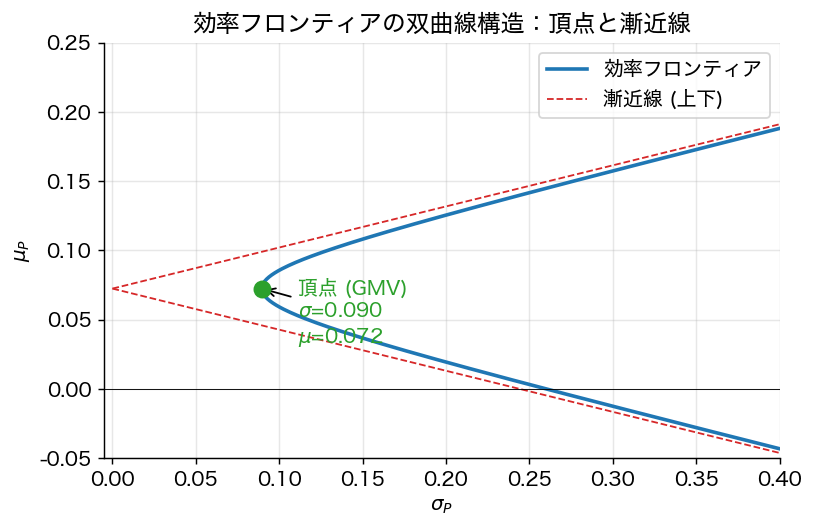
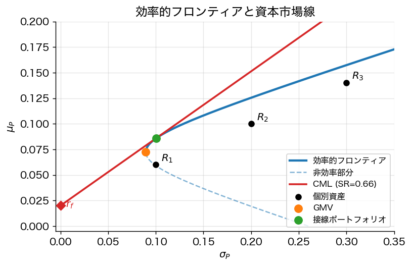
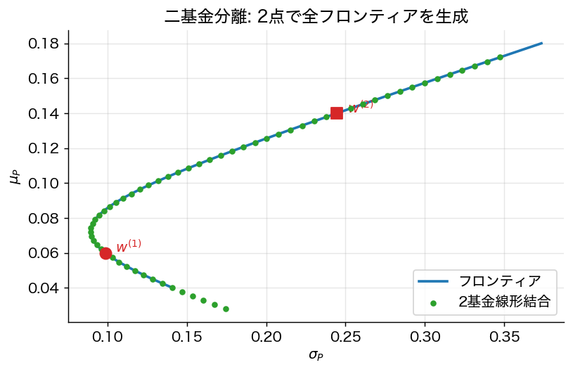
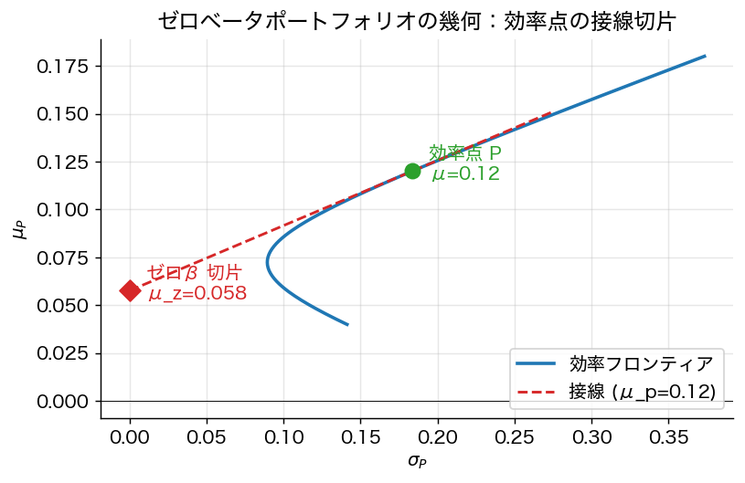

# 第2章 効率的フロンティアの解析的構造

## 2.1 フロンティアの方程式

前章 (1.1) より $(\sigma_P, \mu_P)$ 平面において
$$
\sigma_P^2 = \frac{A_0 \mu_P^2 - 2 B_0 \mu_P + C_0}{D_0}
$$
これは $\mu_P$ について二次なので、$(\sigma_P, \mu_P)$ 平面では **双曲線（hyperbola）** をなす。整理すると
$$
\frac{\sigma_P^2}{1/A_0} - \frac{(\mu_P - B_0/A_0)^2}{D_0/A_0^2} = 1. \tag{2.1}
$$

- **頂点**：$(\sigma, \mu) = (1/\sqrt{A_0},\ B_0/A_0)$ ＝ **GMV ポートフォリオ**。
- **漸近線の傾き**：$\pm \sqrt{D_0/A_0}$。
- **効率的フロンティア（efficient frontier）**：$\mu_P \ge B_0/A_0$ となる上半枝。

### 2.1.1 平方完成による双曲線形の段階的導出

(2.0) を双曲線標準形に整理する：
$$\sigma_P^2 = \frac{A_0 \mu_P^2 - 2 B_0 \mu_P + C_0}{D_0}. \tag{2.0}$$

**Step 1**：$\mu_P$ について平方完成：
$$A_0 \mu_P^2 - 2 B_0 \mu_P + C_0 = A_0 (\mu_P - B_0/A_0)^2 + (C_0 - B_0^2/A_0) = A_0 (\mu_P - B_0/A_0)^2 + D_0/A_0.$$

**Step 2**：両辺を $D_0$ で割って整理：
$$\sigma_P^2 - 1/A_0 = (A_0/D_0)(\mu_P - B_0/A_0)^2$$
すなわち (2.1)。$X^2/a^2 - Y^2/b^2 = 1$ 型の **双曲線**（$X = \sigma_P, Y = \mu_P - B_0/A_0$）。

> 📐 **数学補足 box：なぜ双曲線で楕円ではないのか**
>
> $D_0 = A_0 C_0 - B_0^2$ は Cauchy–Schwarz 型不等式から非負。$\mu$ が $\mathbf{1}$ に **比例しない** とき（市場に少なくとも 2 種類のリターン水準の資産が存在）$D_0 > 0$ となり、(2.1) の左辺第 2 項に「マイナス」が立って **双曲線**。$\mu \parallel \mathbf{1}$ なら $D_0 = 0$ で退化し、効率フロンティアは 1 点（全資産が同じ期待リターンなので分散最小化だけが意味を持つ）。

## 2.2 二基金分離（数学的バージョン）

**定理 2.1**
任意の効率的ポートフォリオ $w^\star(\mu_P)$ は、**フロンティア上の任意の二つ** の異なるポートフォリオ $w^{(1)}, w^{(2)}$ の **アフィン結合** として書ける：
$$
w^\star(\mu_P) = (1-t)\, w^{(1)} + t\, w^{(2)},\qquad t = \frac{\mu_P - \mu_1}{\mu_2 - \mu_1}.
$$

*証明方針*：定理 1.3 の解は $\mu_P$ について一次（重みが $(C_0 - B_0\mu_P)/D_0$ と $(A_0\mu_P - B_0)/D_0$）。したがって $\mu_P$ の関数として **アフィン**。二点を通るアフィン写像は唯一。$\square$

これが Tobin の **二基金分離定理** の数学的核（無リスク資産なし版）である。

## 2.3 直交分解と「ゼロ β ポートフォリオ」

ある効率的ポートフォリオ $w_p$ に対して、**$w_p$ と無相関** な効率的ポートフォリオ $w_z$ が一意に存在し、これを $w_p$ の **ゼロ β 同伴ポートフォリオ** という。

**命題 2.2**
$w_p$ の期待リターンを $\mu_p$ とするとき、ゼロ β 同伴ポートフォリオの期待リターンは
$$
\mu_z(\mu_p) = \frac{C_0 - B_0 \mu_p}{B_0 - A_0 \mu_p}.
$$

*証明方針*：$w_z^\top \Sigma w_p = 0$ を (1.1) 周辺の代数で要求し、定理 1.3 の表現を用いて $\mu_p, \mu_z$ の関係を導く。$\square$

**幾何的意味**：$(\sigma_P, \mu_P)$ 平面において、$w_p$ における **フロンティアの接線** が縦軸（$\sigma = 0$ 軸）と交わる点が $\mu_z$。これは **Black (1972) のゼロ β CAPM** の出発点となる。

### 2.3.1 ゼロ β 同伴の幾何的構成

ゼロ β 同伴ポートフォリオを **幾何的に** 見るには：効率点 $P = (\sigma_P, \mu_P)$ におけるフロンティアの **接線** を引き、それが縦軸 ($\sigma = 0$) と交わる点が $\mu_z$ となる。

**証明スケッチ**：フロンティアの接線の傾きは点 $(σ_p, μ_p)$ で
$$\frac{d\mu_P}{d\sigma_P}\bigg|_{P} = \frac{\sigma_P (\text{at } P) \cdot D_0}{A_0 \mu_P - B_0}.$$
（(2.0) を $\mu_P$ で偏微分すると $2\sigma_P \cdot d\sigma_P/d\mu_P = (2 A_0 \mu_P - 2 B_0)/D_0$ で逆数を取る）

接線が縦軸を切る切片 $\mu_z$ は $\mu_z = \mu_P - \sigma_P \cdot (d\mu_P/d\sigma_P)$。代入して整理すれば命題 2.2 を得る。$\square$

## 2.4 接線ポートフォリオ（無リスク資産あり）

無リスク資産（リターン $r_f$）が存在するとき、危険資産集合の効率的フロンティアからの最善は **接線ポートフォリオ** $w^T$ を介して達成される。

**定理 2.3**（接線ポートフォリオの公式）
$\mu - r_f \mathbf{1} \neq 0$ かつ $\mathbf{1}^\top \Sigma^{-1}(\mu - r_f \mathbf{1}) \neq 0$ とする。シャープ比
$$
\mathrm{SR}(w) := \frac{w^\top \mu - r_f}{\sqrt{w^\top \Sigma w}}
$$
を最大化する $\mathbf{1}^\top w = 1$ 制約下の解は
$$
\boxed{\;
w^T = \frac{\Sigma^{-1}(\mu - r_f \mathbf{1})}{\mathbf{1}^\top \Sigma^{-1}(\mu - r_f \mathbf{1})}
\;}
$$
で与えられ、最大シャープ比は
$$
\mathrm{SR}^\star = \sqrt{(\mu - r_f\mathbf{1})^\top \Sigma^{-1} (\mu - r_f\mathbf{1})}.
$$

*証明方針*（スカラー倍同変性を活用）：シャープ比は $w$ のスケーリングに不変なので、制約 $\mathbf{1}^\top w = 1$ を外して $w^\top\Sigma w \le 1$ の下で $w^\top(\mu - r_f \mathbf{1})$ を最大化する問題と等価。Lagrangian $w^\top(\mu - r_f\mathbf{1}) - \tfrac{\lambda}{2}(w^\top \Sigma w - 1)$ より $w \propto \Sigma^{-1}(\mu - r_f\mathbf{1})$、正規化して結論。最大値はコーシー・シュワルツ型評価から $\sqrt{(\mu-r_f\mathbf{1})^\top \Sigma^{-1}(\mu-r_f\mathbf{1})}$。$\square$

### 2.4.1 接線ポートフォリオの手計算例

第1章の 3 資産例（$\mu = (0.06, 0.10, 0.14), \Sigma$ は前述）と $r_f = 0.02$ を使う。

**Step 1**：リスクプレミアム $\mu - r_f \mathbf{1} = (0.04, 0.08, 0.12)$。

**Step 2**：$\Sigma^{-1}(\mu - r_f \mathbf{1})$ を計算。前章の $\Sigma^{-1}$ を使うと
$$
\Sigma^{-1}(\mu - r_f \mathbf{1}) \approx (3.71, 1.85, 1.27)^\top.
$$

**Step 3**：正規化：分母 $\mathbf{1}^\top \Sigma^{-1}(\mu - r_f \mathbf{1}) = 3.71 + 1.85 + 1.27 = 6.83$。
$$
w^T \approx (0.54, 0.27, 0.19)^\top.
$$

**Step 4**：シャープ比 $\mathrm{SR}^\star = \sqrt{(\mu-r_f\mathbf{1})^\top \Sigma^{-1}(\mu-r_f\mathbf{1})} = \sqrt{0.04 \cdot 3.71 + 0.08 \cdot 1.85 + 0.12 \cdot 1.27} \approx \sqrt{0.4475} \approx 0.669$。

**Step 5**：接線ポートフォリオの期待リターン・標準偏差：
$$
\mu_T = w^{T\top} \mu \approx 0.54 \cdot 0.06 + 0.27 \cdot 0.10 + 0.19 \cdot 0.14 \approx 0.086,
$$
$$
\sigma_T = \sqrt{w^{T\top} \Sigma w^T} \approx \sqrt{0.0098} \approx 0.099.
$$
シャープ比チェック：$(0.086 - 0.02)/0.099 \approx 0.667$、確かに $\mathrm{SR}^\star$ に一致（端数誤差）。

これが第3章で扱う **二基金分離** の中核的ポートフォリオ。すべての投資家は「リスク許容度に応じて、無リスク資産と $w^T$ を組合せる」ことになる。

## 2.5 資本市場線（Capital Market Line; CML）

無リスク資産と接線ポートフォリオの組合せは $(\sigma, \mu)$ 平面で **直線** をなす：
$$
\mu_P = r_f + \mathrm{SR}^\star \cdot \sigma_P, \qquad \sigma_P \ge 0.
$$
これが **資本市場線（CML）** で、無リスク資産が利用可能な投資家の効率フロンティアとなる。すべての投資家は **「無リスク資産 + 接線ポートフォリオ」** の二点だけを組合せれば良い（Tobin の分離定理、第3章で詳説）。

## 2.6 制約付き効率フロンティアの形

ショート禁止 $w \ge 0$ などの不等式制約下では、効率フロンティアは **区分的に双曲線** をなす（active 制約が変わるごとに別の双曲線になる）。

**事実 2.4**
標準制約付きフロンティアは **連続かつ凹** であり、有限個の双曲線セグメントから構成される。各セグメントは「ある不等式制約の active 集合が固定された二次計画」の最適性条件を満たす。

*証明方針*：パラメトリック二次計画の感度解析。$\mu_P$ の変化に対する KKT 系の連続パラメトリック解析（critical region 分析）による。$\square$

## 2.7 数値例（コードは付録参照）

3 資産、$r_f = 1\%$、$\mu = (8, 12, 15)^\top$%、共分散行列を適当に与えると：
- GMV：分散最小、低リターン
- 接線：シャープ比最大
- CML：これらを結ぶ直線、危険資産の双曲線フロンティアに接する

`scripts/efficient_frontier.py`（実装は読者の演習）で可視化できる。

## 2.8 まとめ

- 効率フロンティアは双曲線、頂点が GMV。
- 任意の二点のアフィン結合で全フロンティアを生成（**二基金分離**）。
- ゼロ β 同伴ポートフォリオの幾何が **Black の CAPM** の鍵。
- 接線ポートフォリオの公式 $w^T \propto \Sigma^{-1}(\mu - r_f\mathbf{1})$ は最も実用上重要な閉形である。

---
[← 第1章](01_markowitz_basics.md) ｜ [次章 → 第3章 二基金分離](03_two_fund_separation.md)
