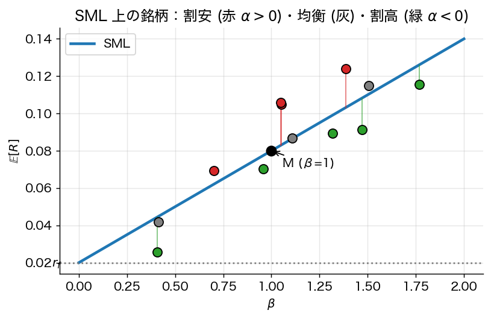
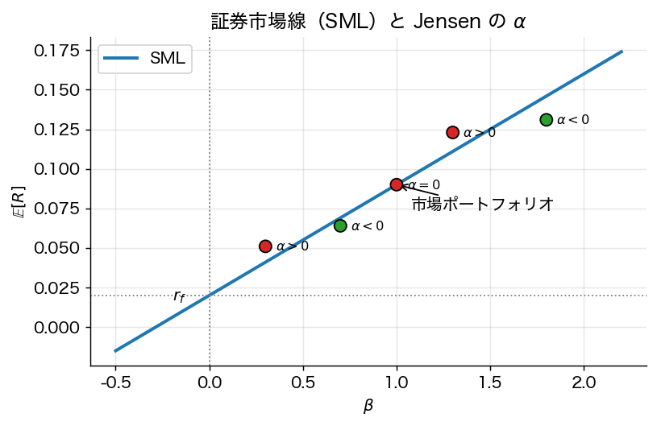

# 第4章 資本資産価格モデル（CAPM）

> 🎯 **この章で答える問い**
> - 個別資産の期待リターンはどのように決まるのか — 何が「リスクの値段」を決めるのか。
> - **β（ベータ）** とは何か、なぜ「分散」ではなく「市場との共分散」で測るのか。
> - 「分散できるリスクには報酬がない」とはどういう意味か。
>
> 📐 **使う数学**：第1–3章の Markowitz と接線ポートフォリオ、共分散の計算、簡単な微分。
>
> 🔑 **主要結果（証券市場線）**：$\mathbb{E}[R_i] - r_f = \beta_i \cdot (\mathbb{E}[R_M] - r_f)$、$\beta_i = \mathrm{Cov}(R_i, R_M) / \mathrm{Var}(R_M)$。

Markowitz は **個人の最適化問題** を解いた。Sharpe (1964), Lintner (1965), Mossin (1966) は「全員が Markowitz 流に最適化している市場の **均衡**」が何を意味するかを問い、CAPM を導いた。

> 📜 **歴史 note：なぜ CAPM が生まれたのか**
>
> Markowitz (1952) は「個人が合理的に分散投資する」枠組みを与えた。しかし「では、その合理的個人が **市場に集まったとき、個別資産の価格はどう決まるか**」という問いは別物である。Sharpe・Lintner・Mossin はこれを 1960 年代半ばに独立に解き、ノーベル経済学賞（Sharpe, 1990）の対象となった。CAPM は単純すぎる仮定（同質期待・1 期間・摩擦なし）で批判されるが、現代ファイナンスの **議論の出発点** であり続けている。

## 4.1 均衡の仮定

1. すべての投資家は同一の信念 $(\mu, \Sigma)$ を持つ（**等質期待**）。
2. すべての投資家は平均分散最適化を行う（同一時点 horizon、二次効用 or 正規分布）。
3. 共通の無リスク利子率で貸借可能。
4. 市場は完全競争・摩擦無し（取引費用・税金なし）。
5. 全資産が市場で取引される。

仮定 1–3 より、第3章の二基金分離が **全投資家** に同時に成立する：彼らは皆 **同一の接線ポートフォリオ** $w^T$ を保有する。市場全体での保有を集計すると、$w^T$ は **市場ポートフォリオ** $w^M$（時価総額比例ウェイト）と一致せねばならない。

## 4.2 CAPM の本体

**定理 4.1**（CAPM、Sharpe–Lintner）
均衡において、任意の資産 $i$ のリスクプレミアムは
$$
\boxed{\;
\mathbb{E}[R_i] - r_f = \beta_i \cdot \big(\mathbb{E}[R_M] - r_f\big),\qquad
\beta_i := \frac{\mathrm{Cov}(R_i, R_M)}{\mathrm{Var}(R_M)}
\;}
$$
で与えられる。これを **証券市場線（Security Market Line; SML）** と呼ぶ。

*証明方針 1（接線ポートフォリオ＝市場ポートフォリオ）*：
- 市場均衡で接線ポートフォリオが市場ポートフォリオに等しい：$w^T = w^M$。
- 接線ポートフォリオの一階条件 $\Sigma w^T \propto \mu - r_f\mathbf{1}$ より $\mu - r_f \mathbf{1} = k\, \Sigma w^M$（ある定数 $k>0$）。
- 各成分は $\mu_i - r_f = k \cdot \mathrm{Cov}(R_i, R_M)$。
- 両辺の市場ポートフォリオ成分（$w^{M\top}(\mu - r_f\mathbf{1}) = k \cdot \mathrm{Var}(R_M)$）から $k = (\mathbb{E}[R_M] - r_f)/\mathrm{Var}(R_M)$。
- 代入して結論。$\square$

*証明方針 2（限界貢献の議論）*：投資家が市場ポートフォリオを保有しているとき、資産 $i$ の保有比率を微小に変えると、ポートフォリオ全体の分散は $\partial \sigma_M^2 / \partial w_i = 2\, \mathrm{Cov}(R_i, R_M)$ の比例で変化する。「リスクの限界貢献」 $\mathrm{Cov}(R_i, R_M)$ あたりのリスクプレミアム（リスク価格）が市場全体で等しいことから SML を得る。$\square$

> 🎯 **直観 box：なぜ「分散できるリスク」には報酬がないのか**
>
> 個別資産 $i$ のリスクには 2 種類ある：
> 1. **市場と一緒に動く部分**（systematic, $\beta_i$ で測る）
> 2. **個別事情で動く部分**（idiosyncratic, 残差 $\varepsilon_i$）
>
> 投資家が **市場ポートフォリオを既に保有している** なら、新たに 1 単位の資産 $i$ を組み入れるとき、ポートフォリオ分散は $\mathrm{Cov}(R_i, R_M)$ の比例で増える — つまり「**$\sigma_i^2$ そのものではなく市場との連動部分のみ**」がリスクとして効く。個別リスクは多数の資産で **互いに相殺** するため、平均的に消えるからである。
>
> したがって市場で「リスクの値段」がつくのは $\beta_i$ だけ。$\sigma_i$ が大きくても $\beta_i = 0$ なら、その資産はリスクフリーレート $r_f$ だけのリターンしか期待されない（CAPM の主張）。

### 4.2.1 個人最適化から市場均衡へ：段階的論理

CAPM の核心は「**個人の最適化 + 集計 = 市場均衡**」の論理である。各 step を整理する。

**Step 1 (個人最適化)**：投資家 $h$ は富 $W_h$ を持ち、平均分散効用を最大化する。第3章の二基金分離より、各人は
$$
w_h^{\rm risky} = \frac{1}{\gamma_h} \Sigma^{-1}(\mu - r_f \mathbf{1})
$$
の方向で危険資産を保有する（量だけが $\gamma_h$ で変わる）。

**Step 2 (集計)**：すべての投資家の危険資産保有を富で加重して合計すると
$$
\sum_h W_h \cdot w_h^{\rm risky} = \sum_h \frac{W_h}{\gamma_h} \Sigma^{-1}(\mu - r_f \mathbf{1}) \propto \Sigma^{-1}(\mu - r_f \mathbf{1}).
$$

**Step 3 (清算条件)**：市場が均衡するとき、需要総量 = 供給総量。供給は時価総額（市場ポートフォリオ）。したがって
$$
w^M \propto \Sigma^{-1}(\mu - r_f \mathbf{1}).
$$

**Step 4 (係数の特定)**：両辺に $\Sigma$ を掛けて $\Sigma w^M = k \cdot (\mu - r_f \mathbf{1})$（ある $k$）。両辺と $w^M$ の内積を取ると
$$
w^{M\top} \Sigma w^M = \sigma_M^2 = k \cdot (\mu_M - r_f), \quad \text{つまり}\ k = \frac{\sigma_M^2}{\mu_M - r_f}.
$$

**Step 5 (CAPM 公式)**：各成分は
$$
\mu_i - r_f = \frac{(\Sigma w^M)_i}{\sigma_M^2} \cdot (\mu_M - r_f) = \frac{\mathrm{Cov}(R_i, R_M)}{\sigma_M^2}(\mu_M - r_f) = \beta_i (\mu_M - r_f).
$$

これが CAPM 公式 (4.1) の **完全な導出**。「個人の Markowitz 最適化 → 集計 → 清算 → 価格決定」の論理連鎖。

## 4.3 β の解釈

- $\beta_i > 1$：市場よりリスキー、より高い期待超過リターン。
- $\beta_i = 1$：市場と同じ。
- $\beta_i < 1$：ディフェンシブ。
- $\beta_i < 0$：市場下落時に上昇する逆相関資産（プット的）。CAPM は $\mathbb{E}[R_i] < r_f$ を予測。

**重要**：$\beta$ は **個別資産の分散** $\sigma_i^2$ ではなく **市場との共分散** に依存する。「分散できる個別リスクには対価が支払われない」というのが CAPM の核心メッセージ。

### 4.3.1 β の手計算例

**設定**：5 年間の月次データで以下が観測されたとする：
- 市場リターンの月次標準偏差：$\sigma_M = 0.045$（年率 $\approx 15.6\%$）
- 銘柄 X の月次標準偏差：$\sigma_X = 0.072$
- 銘柄 X と市場の相関：$\rho_{X,M} = 0.65$

**β の計算**：
$$
\beta_X = \frac{\mathrm{Cov}(R_X, R_M)}{\mathrm{Var}(R_M)} = \frac{\rho_{X,M} \sigma_X \sigma_M}{\sigma_M^2} = \rho_{X,M} \cdot \frac{\sigma_X}{\sigma_M} = 0.65 \cdot \frac{0.072}{0.045} = 1.04.
$$

**期待リターン (CAPM)**：$r_f = 0.02$（年率）、$\mu_M - r_f = 0.06$（年率）とすると
$$
\mu_X^{\rm CAPM} = 0.02 + 1.04 \cdot 0.06 = 0.082\quad (8.2\%).
$$

**Jensen α**：もし実際の平均リターンが $\bar R_X = 0.095$ なら
$$
\alpha_X = 0.095 - 0.082 = 0.013\quad (1.3\%\text{ pa}).
$$
CAPM では均衡で $\alpha = 0$ なので、これは「**市場が説明できない超過リターン**」、すなわち「割安」「運用力」「未知のリスク因子」のいずれか。

> 📐 **数学補足 box：β は OLS 回帰の傾き**
>
> $\beta_X$ は実装的には **時系列単回帰**
> $$ R_{X,t} - r_{f,t} = \alpha_X + \beta_X (R_{M,t} - r_{f,t}) + \varepsilon_{X,t} $$
> の傾き係数。OLS では
> $$ \hat\beta_X = \frac{\sum_t (R_{X,t} - \bar R_X)(R_{M,t} - \bar R_M)}{\sum_t (R_{M,t} - \bar R_M)^2}. $$
> Python なら `scipy.stats.linregress` や `numpy.polyfit`、`statsmodels.OLS` で 1 行。

## 4.4 Black のゼロ β CAPM

無リスク資産が利用できない（あるいは借入金利が貸出金利と異なる）場合：

**定理 4.2**（Black 1972）
任意の効率的ポートフォリオ $w_p$ とそのゼロ β 同伴ポートフォリオ $w_z$（命題 2.2）に対して
$$
\mathbb{E}[R_i] = \mathbb{E}[R_z] + \beta_i^{(p)} (\mathbb{E}[R_p] - \mathbb{E}[R_z]),\qquad \beta_i^{(p)} = \mathrm{Cov}(R_i, R_p)/\mathrm{Var}(R_p).
$$

均衡では $w_p = w^M$ とすればよい。**ゼロ β 期待リターン** $\mathbb{E}[R_z]$ が $r_f$ の役割を果たす。

*証明方針*：効率的フロンティア上の任意の二点の幾何（接線が縦軸と交わる切片＝ゼロ β 期待リターン）と、定理 4.1 と同じ限界貢献論証。$\square$

## 4.5 CAPM の実証検証と Roll 批判

代表的検証手順：**Fama–MacBeth (1973) の二段階回帰**

1. 時系列回帰：各資産 $i$ について $R_{it} - r_{ft} = \alpha_i + \beta_i (R_{Mt} - r_{ft}) + \varepsilon_{it}$ で $\hat\beta_i$ を推定。
2. 横断面回帰：$\bar R_i - \bar r_f = \gamma_0 + \gamma_1 \hat\beta_i + \eta_i$。CAPM が正しければ $\gamma_0 = 0$, $\gamma_1 = \bar R_M - \bar r_f$。

実証結果：
- $\gamma_1 > 0$ だが $\bar R_M - \bar r_f$ より小さい（SML が **平坦**）。
- $\gamma_0 > 0$（low β 異常）。
- サイズ（Banz 1981）、バリュー（Fama–French 1992）などの **CAPM 残差** が説明力を持つ。

**Roll の批判（1977）**：
CAPM の検証には **真の市場ポートフォリオ** $w^M$ が必要だが、これは観測不可能（全富—不動産、人的資本、海外資産—を含む）。プロキシ（株価指数）を用いた検証は実質的に「そのプロキシが平均分散効率的か」のテストにしかならない。したがって **CAPM 自体は反証不可能**。

## 4.6 条件付き CAPM・消費 CAPM

- **条件付き CAPM**：$\beta$ と市場プレミアムが時変。
- **消費 CAPM（CCAPM, Breeden 1979, Lucas 1978）**：効用最大化の一階条件から、リスクプレミアムは **消費成長率との共分散** に比例。
$$
\mathbb{E}[R_i] - r_f = \gamma\, \mathrm{Cov}(R_i, \Delta c)
$$
（$\gamma$ は相対リスク回避度、$c$ は対数消費）。$M_{t+1} = \beta\, u'(c_{t+1})/u'(c_t)$ という **確率割引因子（SDF）** が中心概念となり、本書終章への橋渡しとなる。

## 4.7 まとめ

- CAPM は **「分散できないリスク（β）」だけがプレミアムを生む** ことを主張する。
- 仮定の強さ（特に等質期待）に比して結論は強力だが、実証的には不十分。
- Roll 批判により検証可能性自体が哲学的問題。
- 次章の **APT** は均衡論を必要としない代替アプローチを与える。

> 🛣 **上級学習への道標**
> - **CCAPM・ICAPM の完全な動的版** は確率割引因子 (Stochastic Discount Factor; SDF) を中心とする。Cochrane *Asset Pricing* (2005) が標準教科書。
> - **β の時変構造** や **条件付き CAPM** の実証は計量経済学の高度な手法（GMM, GARCH）を要する。
> - **Black-Scholes 型のリスク中立価格付け** とは別の世界（実際の発生確率 vs 価格計算用の確率）であることに注意。

---
[← 第3章](03_two_fund_separation.md) ｜ [次章 → 第5章 APT とファクターモデル](05_apt_factor_models.md)
